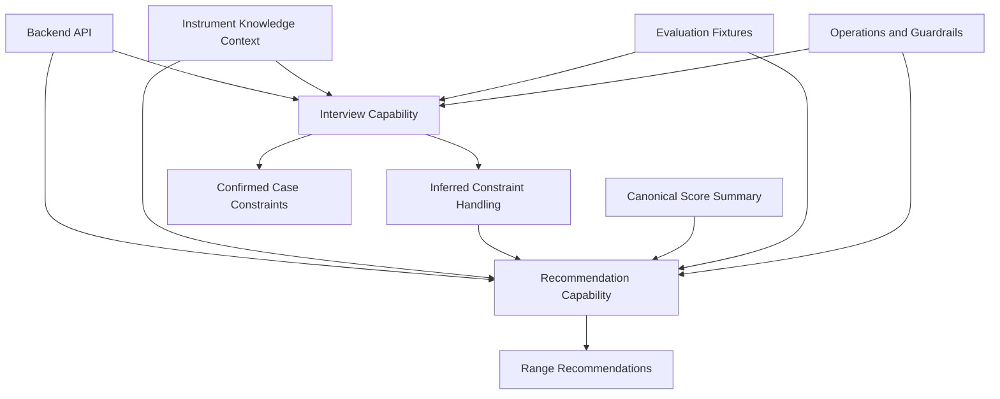

# AI Capability Structure

Reference: [AI Index](./index.md)
Related architecture: [Module Design](../architecture/module-design.md)
Related interfaces: [Interfaces](../architecture/interfaces.md)
Related observability: [Observability](../architecture/observability.md)

## Purpose

This document defines the planned AI capability split for the MVP and maps the approved architecture to concrete AI-facing concerns.

## Planned AI Areas

- `interview`: structured questionnaire logic, follow-up decision logic, and typed constraint extraction
- `recommendation`: target-range recommendation generation and explanation production
- `knowledge-context`: backend-supplied instrument capability context used to ground interview and recommendation behavior
- `inference-state`: handling of AI-derived but not yet confirmed constraints
- `evaluation`: regression fixtures, confidence review, over-inference checks, and output-quality checks
- `operations`: provider abstraction, logging, failure handling, runtime guardrails, and presentation-safety boundaries

Runtime boundary note:
Interview and recommendation capabilities may be invoked from synchronous API flow or asynchronous worker flow, but both paths should use the same provider-adapter and context-assembly boundaries.
Cloud deployment should preserve that runtime parity by keeping provider configuration, timeout policy, and credential handling aligned between API and worker services.

## Capability Structure Diagram

Diagram purpose:
Show the planned AI capability split and the boundaries between interview behavior, recommendation behavior, grounding context, evaluation, and runtime operations.

What to read from it:
The AI layer is not a single generic prompt. It is split into distinct capabilities with separate inputs, outputs, and operational concerns, including explicit handling for inferred-but-not-yet-confirmed constraints.

Why it belongs here:
This file owns the internal AI capability decomposition and how it maps to the approved architecture.

## Capability Mapping To Architecture

- `interview` maps to the `AI Interview Service`
- `recommendation` maps to the `AI Recommendation Service`
- `knowledge-context` supports the `Instrument Knowledge Service` boundary without replacing it
- `inference-state` maps to `InferredConstraintSet` handling and must stay distinct from confirmed case state
- `evaluation` supports AI-specific quality control without changing application flow
- `operations` supports observability, failure handling, and provider isolation
- worker and request paths should reuse the same AI capability boundaries instead of splitting behavior by runtime path

## Runtime Rules

- Interview outputs must be schema-constrained before they are written into case constraints.
- AI-inferred constraints must remain explicitly marked as inferred until backend confirmation rules promote them into confirmed case state.
- Recommendation outputs must remain advisory and must not bypass user selection.
- Low-confidence outputs should trigger follow-up handling or explicit failure, not silent guessing.
- Confidence handling should align with the architecture-level `high`, `medium`, `low`, and `blocked` policy.
- AI capabilities must consume backend-provided structured context instead of relying only on implicit model memory.
- Raw provider text and raw prompt material should not be treated as normal user-facing product output.

## Evaluation Priorities

- verify extraction quality for instrument, range, and difficulty-related interview answers
- verify follow-up behavior when interview inputs are incomplete
- verify that inferred constraints are not exposed as confirmed constraints without confirmation
- verify recommendation consistency for the same score and case inputs
- verify confidence behavior for ambiguous or underspecified cases
- verify failure behavior when the model cannot produce a grounded result
- verify blocked-confidence cases do not degrade into fabricated normal-looking recommendations
- verify free-form model text does not bypass schema-constrained output handling in persisted or user-facing paths
- verify the same evaluation fixtures remain valid across API-triggered and worker-triggered runtime paths

## Testing Collaboration Expectation

- AI evaluation fixtures should be shaped so backend contract tests and release checks can reuse them without depending on raw provider text.
- Safety-critical AI fixtures should explicitly cover over-inference, blocked confidence, and confirmation-boundary cases as regression inputs rather than ad hoc manual checks.
