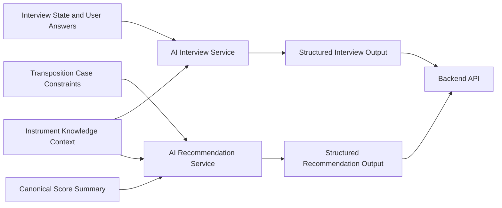

# AI Implementation Plan

Reference: [AI Index](./index.md)
Related architecture: [Architecture Overview](../architecture/overview.md)
Related modules: [Module Design](../architecture/module-design.md)
Related interfaces: [Interfaces](../architecture/interfaces.md)
Related observability: [Observability](../architecture/observability.md)

## Purpose

This document defines the planned AI delivery model for the MVP and explains how the approved AI responsibilities will be implemented without taking over deterministic backend execution.

## AI Scope For The MVP

The MVP AI layer has two core runtime responsibilities:

- conduct the structured interview that collects or infers instrument and playability constraints
- generate one or more recommended target ranges for a parsed score and active transposition case

The AI layer does not own:

- direct score mutation
- file parsing
- artifact persistence
- final transposition execution

## Recommended Technical Direction

- model interaction style: structured LLM calls with schema-constrained outputs
- primary AI runtime: backend-owned provider adapter behind an internal service boundary
- interview strategy: stepwise structured questioning with typed follow-up prompts
- recommendation strategy: score-aware recommendation generation from canonical score summaries and case constraints
- fallback strategy: fail visibly when confidence is too low instead of silently inventing constraints or recommendations
- retrieval posture: no mandatory full RAG stack for the MVP

Backend runtime expectation:
The same backend-owned AI provider adapter and context-assembly boundaries should be used consistently from both synchronous request handling and asynchronous worker execution paths.

## Required Architecture Alignment

- AI services must consume the structured `AI Context Contract` defined in [Interfaces](../architecture/interfaces.md).
- AI-derived but not yet confirmed constraints must remain separate from confirmed case constraints through `InferredConstraintSet`.
- Recommendation confidence must follow the operational `Confidence And Fallback Policy` defined in [Observability](../architecture/observability.md).
- Interview outputs, inferred constraints, and confirmed case constraints must not be treated as interchangeable states.

## Best-Practice Baseline And Adapted Recommendation

Best-practice baseline:
A production-grade AI system often uses a layered retrieval stack, explicit evaluation sets, model routing, and provider abstraction from the start.

Adapted recommendation for this project:
The MVP should start with structured LLM calls and narrowly scoped backend-owned orchestration rather than a full RAG platform. This keeps the AI layer explainable enough for interview and recommendation tasks while avoiding unnecessary infrastructure before the product flow is validated.

## AI Delivery Diagram

Diagram purpose:
Show the MVP AI responsibilities and the data they consume and return without collapsing them into deterministic backend execution.

What to read from it:
The AI layer works on structured inputs such as interview state, confirmed case constraints, AI-inferred constraints when available, instrument knowledge, and score summaries, then returns structured outputs that the backend can validate and persist.

Why it belongs here:
This file owns the AI implementation approach and runtime responsibility model for the MVP.

## Implementation Priorities

1. Define schema-constrained outputs for interview responses and recommendation payloads.
2. Implement the AI interview path that asks follow-up questions when user input is incomplete or ambiguous.
3. Implement the AI recommendation path that consumes canonical score summaries and active case constraints.
4. Implement explicit handling for `InferredConstraintSet` so advisory AI-derived constraints remain distinguishable from confirmed user constraints.
5. Add confidence signaling and visible failure behavior for low-certainty outputs.
6. Add AI-specific observability for prompts, structured outputs, confidence, and failure classes.
7. Add evaluation fixtures for representative interview and recommendation cases.

## Dependency Policy

- Keep provider-specific logic behind internal adapters.
- Prefer structured outputs over free-form text wherever backend persistence depends on the result.
- Do not introduce a full vector-database stack unless the MVP proves that simple instrument-knowledge handling is insufficient.
- Do not bypass backend validation with direct model outputs.
- Do not promote inferred constraints into confirmed case state without backend-controlled confirmation rules.
- Do not create separate AI-call semantics for API and worker paths when the same provider adapter and context contract can be reused.
