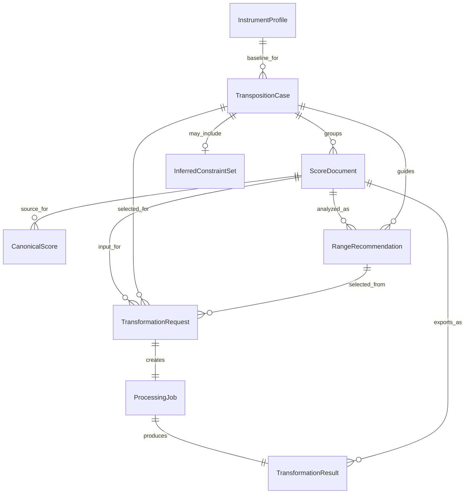

# Data Model

Reference: [Architecture Index](./index.md)
Related modules: [Module Design](./module-design.md)
Related context: [System Context](./system-context.md)

## Modeling Principle

The system separates persistent transposition case constraints, structured instrument knowledge, uploaded artifacts, normalized musical structure, recommendation outputs, transformation requests, and generated results.
This keeps conversational intake, reusable case state, file handling, recommendation logic, and deterministic execution independent.

## Core Entities

### ScoreDocument

Purpose:
Represent an uploaded or generated file artifact.

Key fields:

- `id`
- `type` such as `original` or `transformed`
- `format`
- `storageUri`
- `checksum`
- `createdAt`

Lifecycle:
Created on upload or export.
Never mutated in place after persistence.

Operational notes:
Original and transformed artifacts should always be stored separately.
`storageUri` is internal persistence metadata and should not be exposed directly as a user-facing read-model field.

### CanonicalScore

Purpose:
Represent the normalized internal music structure.

Key fields:

- `id`
- `schemaVersion`
- `scoreDocumentId`
- `parts`
- `measures`
- `notes`
- `rests`
- `clefs`
- `keySignatures`
- `timeSignatures`
- `tempo`

Lifecycle:
Created after parsing.
May be regenerated when parser logic evolves.

Operational notes:
This model is the source of truth for transformation logic, not the raw MusicXML.

### InstrumentProfile

Purpose:
Describe the musical and notation constraints of a target instrument.

Key fields:

- `id`
- `name`
- `transposition`
- `writtenRangeMin`
- `writtenRangeMax`
- `soundingRangeMin`
- `soundingRangeMax`
- `preferredClefs`

Lifecycle:
Managed as reference data.

Operational notes:
Profiles should be versioned carefully because transformation behavior depends on them.

### InferredConstraintSet

Purpose:
Represent AI-derived constraints that are useful for recommendation or follow-up questioning but are not yet equivalent to confirmed user constraints.

Key fields:

- `id`
- `transpositionCaseId`
- `highestPlayableTone`
- `lowestPlayableTone`
- `restrictedTones`
- `restrictedRegisters`
- `difficultKeys`
- `preferredKeys`
- `comfortRangeMin`
- `comfortRangeMax`
- `confidence`
- `source` such as `ai_inference`
- `createdAt`

Lifecycle:
Created or updated during interview processing when the AI infers likely constraints from incomplete user input or structured instrument context.
May be replaced, confirmed into the main case fields, or discarded as the interview progresses.

Operational notes:
This entity must remain distinct from both generic instrument knowledge and confirmed user-specific case constraints.
When structured fields are sufficient, inferred constraints should remain stored in typed fields rather than broad free-text blobs.

### TranspositionCase

Purpose:
Represent a persistent user and instrument context that can be reused across multiple score uploads.

Key fields:

- `id`
- `userId`
- `instrumentProfileId`
- `highestPlayableTone`
- `lowestPlayableTone`
- `restrictedTones`
- `restrictedRegisters`
- `difficultKeys`
- `preferredKeys`
- `comfortRangeMin`
- `comfortRangeMax`
- `status`
- `createdAt`
- `updatedAt`

Lifecycle:
Created during the interview flow and reused across multiple uploads until the user resets, archives, or replaces it.

Operational notes:
This case captures the playable reality of a specific user and instrument setup, not just the general capability of an instrument.
Confirmed case fields should remain distinguishable from AI-inferred but not yet confirmed constraints.
Structured constraint fields should be preferred over unnecessary free-text persistence so user-specific capability data remains minimized and reviewable.

### TransformationRequest

Purpose:
Represent a user request to execute a deterministic conversion using a selected recommendation.

Key fields:

- `id`
- `sourceScoreDocumentId`
- `transpositionCaseId`
- `selectedRecommendationId`
- `targetRange`
- `mode`
- `requestedAt`

Lifecycle:
Created when a user starts a conversion job.

Operational notes:
The request record should preserve the exact processing intent for auditability.

### RangeRecommendation

Purpose:
Represent an AI-generated recommendation set for score transposition targets.

Key fields:

- `id`
- `scoreDocumentId`
- `transpositionCaseId`
- `recommendedRanges`
- `recommendedKeys`
- `explanations`
- `confidence`
- `createdAt`

Lifecycle:
Created after score analysis and referenced during user selection.

Operational notes:
Recommendations may contain multiple valid target ranges rather than a single forced answer.

### ProcessingJob

Purpose:
Track execution state and runtime outcomes.

Key fields:

- `id`
- `transformationRequestId`
- `status`
- `startedAt`
- `finishedAt`
- `processingPath`
- `errorCode`
- `warningCount`

Lifecycle:
Created at job start and updated until completion.

Operational notes:
Jobs should be observable without requiring direct access to generated files.
Raw provider responses, raw prompts, and raw backend exception text should not be required as part of the user-facing observability model.

### TransformationResult

Purpose:
Represent the outcome of a completed conversion.

Key fields:

- `id`
- `processingJobId`
- `outputScoreDocumentId`
- `changedMeasures`
- `warnings`
- `confidence`

Lifecycle:
Created after successful or partially successful transformation.

Operational notes:
Confidence should be used only as advisory metadata, not as the only quality signal.

## Data Relationship Diagram

Diagram purpose:
Show the core persistence entities and the relationships that connect reusable cases, uploaded scores, recommendations, execution requests, and generated results.

What to read from it:
The model separates reusable user/instrument context, AI-inferred transient constraints, uploaded files, recommendation outputs, execution tracking, and final artifacts so each lifecycle can evolve independently.

Why it belongs here:
This file owns the persistent entities, their lifecycle role, and their relationship structure.

## Consistency Rules

- A transformed file must always retain a reference to the original input request.
- A processing job must not overwrite the original artifact.
- Canonical score schema versioning must be explicit.
- AI-generated recommendations must remain attributable through recommendation and processing metadata.
- Transposition case constraints must persist across multiple uploads until the user resets or replaces the case.
- User-specific case constraints must be stored separately from generic instrument profiles.
- AI-inferred constraints must be stored separately from confirmed case constraints.
