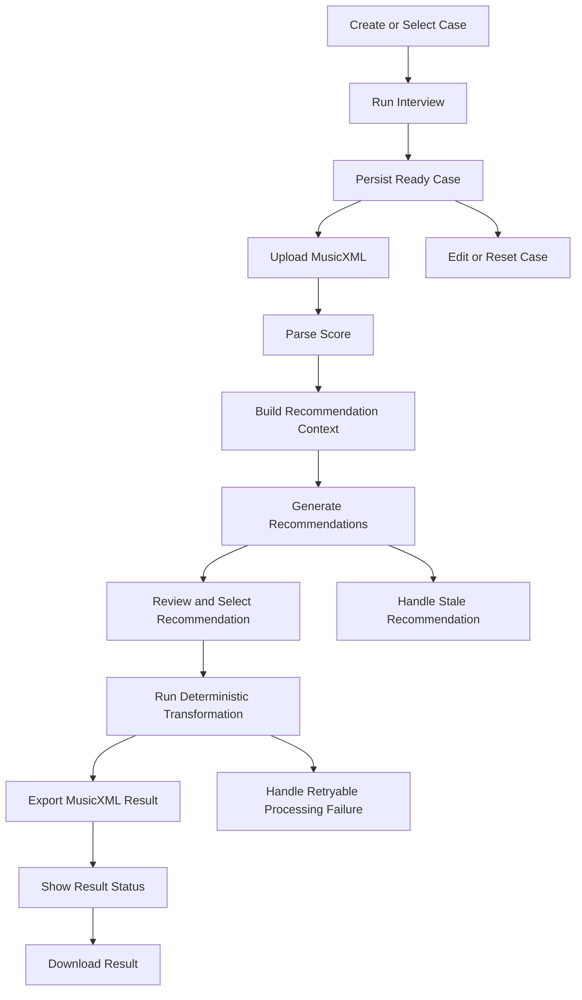

# Architecture Features

Reference: [Architecture Index](./index.md)
Related context: [System Context](./system-context.md)
Related modules: [Module Design](./module-design.md)
Related interfaces: [Interfaces](./interfaces.md)
Related frontend state mapping: [Frontend State Mapping](./frontend-state-mapping.md)
Related delivery planning: [Junior Task Breakdown](../delivery/junior-task-breakdown.md)

## Purpose

This document breaks the approved architecture into small implementation features.
The goal is to support MVP delivery through simple, independently understandable slices rather than a few large multi-module features.

## Feature Decomposition Principle

- prefer more small features over fewer complex features
- start from the minimum user-visible MVP
- keep features aligned with existing architecture boundaries
- assign the responsible agents for each feature so ownership stays clear
- treat later growth features as explicit follow-up work, not hidden MVP scope

## MVP Feature Flow Diagram

Diagram purpose:
Show the MVP delivery order as small features that can be implemented and validated step by step.

What to read from it:
The first usable product does not require one large transposition feature. It emerges from a chain of small capabilities: case setup, interview, upload, parsing, recommendation, selection, deterministic execution, and result access.

Why it belongs here:
This file owns feature slicing at architecture level and is the correct place to show the intended implementation progression from minimal MVP to a first working product flow.

## Feature List

### F1. Case Entry

Goal:
Let the user create a new transposition case or continue an existing active one.

Scope:

- list reusable cases
- suggest the most recently used active case
- allow starting a new case

Responsible agents:

- lead: `Frontend`
- support: `Backend`
- consult: `Architect`

Why it is small:
This feature stops before any interview logic or upload logic starts.

### F2. Structured Interview Session

Goal:
Run the AI-guided question flow that collects instrument and playability constraints.

Scope:

- render structured question objects
- submit structured answers
- continue interview sessions
- surface follow-up questions when confidence is low

Responsible agents:

- lead: `AI`
- support: `Frontend`, `Backend`
- consult: `Architect`

Why it is small:
This feature only covers interview interaction and does not yet include upload or recommendation generation.

### F3. Case Readiness And Persistence

Goal:
Store confirmed case constraints and expose when a case is ready for upload.

Scope:

- persist interview-derived case state
- expose `ready_for_upload`
- keep multiple instrument cases separate

Responsible agents:

- lead: `Backend`
- support: `AI`, `Test`
- consult: `Architect`

Why it is small:
This feature focuses only on case lifecycle and readiness state, not score handling.

### F4. MusicXML Upload Acceptance

Goal:
Accept a MusicXML upload that is linked to a ready transposition case.

Scope:

- validate file type
- bind upload to `transpositionCaseId`
- store original artifact reference
- return initial score-processing snapshot

Responsible agents:

- lead: `Backend`
- support: `Frontend`, `Test`
- consult: `Architect`, `Safety`

Why it is small:
This feature ends at accepted upload and does not include parsing success yet.

### F5. Score Parsing

Goal:
Turn the uploaded MusicXML file into the canonical score model.

Scope:

- validate MusicXML
- parse the score
- persist parse success or typed parse failure

Responsible agents:

- lead: `Backend`
- support: `Test`
- consult: `Architect`

Why it is small:
This feature is purely about parsing and canonicalization.

### F6. Recommendation Context Assembly

Goal:
Assemble the backend-owned context needed for AI recommendation.

Scope:

- combine case constraints
- combine instrument knowledge
- combine canonical score summary
- include inferred constraints only as advisory context

Responsible agents:

- lead: `Backend`
- support: `AI`, `Test`
- consult: `Architect`

Why it is small:
This feature prepares recommendation input without generating recommendations yet.

### F7. Recommendation Generation

Goal:
Produce one or more recommended target ranges for the uploaded score.

Scope:

- call the AI recommendation path
- return primary and secondary options
- expose confidence and warnings
- fail with typed status when blocked

Responsible agents:

- lead: `AI`
- support: `Backend`
- consult: `Architect`, `Safety`

Why it is small:
This feature ends when recommendations exist and does not include user selection or deterministic execution.

### F8. Recommendation Review And Selection

Goal:
Let the user inspect recommendation options and explicitly choose one.

Scope:

- show primary and secondary recommendation items
- show warnings and confidence
- allow explicit user selection

Responsible agents:

- lead: `Frontend`
- support: `Backend`
- consult: `Designer`, `Architect`

Why it is small:
This feature is about decision presentation, not score mutation.

### F9. Deterministic Transformation

Goal:
Apply the selected target range through backend-owned deterministic transposition.

Scope:

- validate selected recommendation or target range
- run transformation rules
- emit warnings when clean adaptation is not possible

Responsible agents:

- lead: `Backend`
- support: `Test`
- consult: `Architect`

Why it is small:
This feature excludes export and download and focuses only on deterministic score mutation.

### F10. Result Export

Goal:
Convert transformed score data into output MusicXML and store the result artifact.

Scope:

- generate output MusicXML
- validate export consistency
- persist output artifact reference

Responsible agents:

- lead: `Backend`
- support: `Test`
- consult: `Architect`

Why it is small:
This feature is only about output generation, not result presentation.

### F11. Processing Status Visibility

Goal:
Expose durable frontend-readable status snapshots for score and transformation flows.

Scope:

- expose queued, parsing, recommendation, transforming, completed, and failed states
- expose warnings and failure metadata
- support frontend polling through stable read endpoints

Responsible agents:

- lead: `Backend`
- support: `Frontend`, `Test`
- consult: `Architect`

Why it is small:
This feature does not create business behavior itself. It exposes process visibility around already existing flows.

### F12. Result Download

Goal:
Let the user download the transformed MusicXML result.

Scope:

- show result readiness
- trigger artifact download
- support print handoff through downloaded output

Responsible agents:

- lead: `Frontend`
- support: `Backend`
- consult: `Architect`

Why it is small:
This feature only covers result retrieval, not transformation itself.

## Supporting MVP Features

### F13. Case Edit And Reset

Goal:
Allow the user to change constraints or reset a case without creating a new architecture path.

Scope:

- edit case constraints
- restart interview when necessary
- reset a case explicitly

Responsible agents:

- lead: `Frontend`
- support: `Backend`, `AI`
- consult: `Architect`, `Test`

### F14. Stale Recommendation Handling

Goal:
Prevent the user from transforming against recommendations that were generated for outdated constraints.

Scope:

- mark recommendation snapshots as stale after relevant case edits
- block stale recommendation reuse
- require regeneration before selection continues

Responsible agents:

- lead: `Backend`
- support: `Frontend`, `Test`
- consult: `Architect`

### F15. Retryable Failure Recovery

Goal:
Support retry behavior for recoverable parsing, recommendation, or transformation failures.

Scope:

- typed failure classes
- retryable status exposure
- frontend retry actions

Responsible agents:

- lead: `Backend`
- support: `Frontend`, `Test`
- consult: `Architect`

### F16. Deployment And Environment Verification

Goal:
Verify that preview and production-like environments preserve the documented MVP workflow and typed runtime-state behavior after deployment.

Scope:

- run post-deploy smoke verification for frontend-to-backend connectivity
- verify API and worker health after deployment
- verify at least one durable score-status read path in the deployed environment
- block release progression when deploy verification fails

Responsible agents:

- lead: `Cloud`
- support: `Test`
- consult: `Architect`

Why it is small:
This feature does not add new product behavior. It verifies that already implemented MVP behavior survives real deployment boundaries.

## First Usable MVP Cut

The first meaningful product demo should include at least:

- `F1` Case Entry
- `F2` Structured Interview Session
- `F3` Case Readiness And Persistence
- `F4` MusicXML Upload Acceptance
- `F5` Score Parsing
- `F6` Recommendation Context Assembly
- `F7` Recommendation Generation
- `F8` Recommendation Review And Selection
- `F9` Deterministic Transformation
- `F10` Result Export
- `F11` Processing Status Visibility
- `F12` Result Download
- `F16` Deployment And Environment Verification

This is the smallest coherent slice that demonstrates the product promise:
the user can define an instrument context, upload a score, receive AI-guided target-range recommendations, select one, and download a transformed result.

## Post-MVP Growth Direction

Natural follow-up features after the first usable MVP include:

- stronger print support in the frontend
- richer recommendation explanation and comparison
- broader instrument knowledge coverage
- more export formats such as PDF or MIDI
- archive and clone behavior for cases
- deeper automated evaluation and regression tooling

## Ownership Rule

- `Architect` owns feature slicing at architecture level.
- Specialist agents own implementation planning and execution inside their feature boundaries.
- If a feature changes shared contracts, module boundaries, or state meaning, `Architect` must be consulted again.

## Delivery Relationship

This document owns feature slicing at architecture level.
Junior-oriented execution breakdown, parallel tasking, and team delivery planning belong in [Junior Task Breakdown](../delivery/junior-task-breakdown.md).
