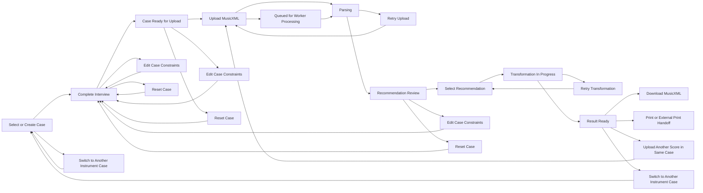
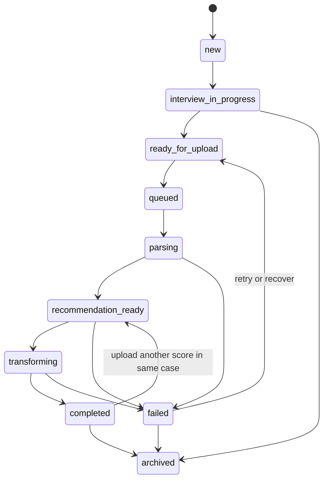

# Frontend State Mapping

Reference: [Architecture Index](./index.md)
Related context: [System Context](./system-context.md)
Related interfaces: [Interfaces](./interfaces.md)
Related observability: [Observability](./observability.md)

## Purpose

This document maps backend architecture concepts to frontend-visible UI states for the MVP.
Its role is to prevent the frontend from inventing product rules that should instead be defined at architecture level.

## UI Flow Stages

The MVP frontend should treat the user journey as these stages:

1. case selection or case creation
2. interview completion
3. upload readiness
4. score upload and parsing
5. recommendation review
6. recommendation selection
7. transformation in progress
8. result ready
9. download or print handoff

## Frontend Flow Diagram

Diagram purpose:
Show the frontend-visible user journey, including the main success path and the key UX branch points that affect case reuse, retry, reset, and instrument switching.

What to read from it:
The frontend is not only a linear upload flow. It must support returning to interview-driven constraint editing, retrying failed steps, reusing a case for another score, switching to another instrument context, and showing queued background processing before active execution begins.

Why it belongs here:
This file owns the UI-facing interpretation of architecture flow and is the correct place to map product states into frontend journey paths.

## Transposition Case States

Recommended UI-facing case states:

- `new`
  A case exists but no usable interview result is available yet.
- `interview_in_progress`
  The user is still answering required questions.
- `ready_for_upload`
  The case has enough validated constraints for score upload and recommendation.
- `queued`
  The request has been accepted and is waiting in the asynchronous worker path before active processing starts.
- `recommendation_ready`
  At least one score in the case has a recommendation set ready for user selection.
- `completed`
  A transformation result has been produced for the current score flow.
- `archived`
  The case is no longer active for new work.

## Frontend State Diagram

Diagram purpose:
Show the allowed UI-facing lifecycle states of a transposition case and the recovery paths between them.

What to read from it:
The frontend should treat these states as a controlled state machine rather than inventing ad hoc transitions between interview, upload, recommendation, transformation, completion, and failure.

Why it belongs here:
This file owns frontend-visible state meaning and the translation of backend lifecycle signals into stable UI behavior.

## Upload Rules

- Upload is blocked for a new case until the interview has reached `ready_for_upload`.
- Upload is allowed for later scores in the same active case without repeating the interview.
- After upload acceptance, the frontend should read `GET /scores/{id}` until score processing leaves `uploaded`, `queued`, or `parsing` and reaches either recommendation readiness or failure.
- If the user edits or resets the case, the case may return to `interview_in_progress`.

## Case Entry Rules

- If multiple active cases exist, the frontend should prioritize the most recently used non-archived case as the default entry suggestion.
- The remaining visible cases should be ordered by most recent use so the user can quickly continue the most relevant instrument context.
- The case selection UI should still show the other available cases so the user can explicitly switch instrument context.
- If no reusable active case exists, the frontend should default to case creation.

## Recommendation UI States

The recommendation screen should distinguish:

- `loading`
- `queued`
- `ready`
- `stale`
- `low_confidence`
- `failed`

Each recommendation item should expose:

- a human-readable label
- a target range
- an optional recommended key
- a short summary reason
- confidence
- warnings
- whether it is the primary recommendation

Recommendation freshness rule:

- If case constraints change after a recommendation set was generated, the existing recommendation set must be treated as stale.
- A stale recommendation set must not be used for deterministic transformation without regeneration.
- The backend should expose staleness through score or recommendation status snapshots instead of requiring the frontend to infer it locally from mutation history alone.
- The frontend should clearly indicate that stale recommendations require a new recommendation request before selection can continue.

## Transformation UI States

The transformation flow should distinguish:

- `waiting_for_selection`
- `transforming`
- `completed`
- `failed`

The frontend should not start transformation automatically before the user explicitly selects a recommendation.

## Error And Warning Mapping

Blocking errors:

- invalid upload
- parse failure
- recommendation generation failure
- transformation failure
- export failure

Recoverable errors:

- temporary recommendation retry
- temporary transformation retry

Informational warnings:

- low-confidence recommendation
- notes near range boundaries
- export consistency warnings that do not invalidate the file

## Download And Print Behavior

- Download of output MusicXML is required in the MVP.
- Direct print may be implemented by the frontend if practical.
- If direct print is not implemented, the frontend should clearly position download as the print handoff path.

## Ownership

- Architecture defines the allowed state meanings.
- Backend exposes the signals and statuses.
- Frontend renders these states and should not redefine them.
