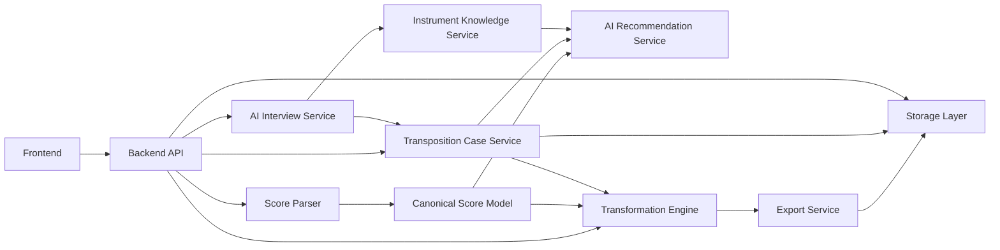

# Module Design

Reference: [Architecture Index](./index.md)

## Design Principle

This document defines the internal runtime modules of the system and the ownership boundaries between them.
High-level architecture direction belongs in [Overview](./overview.md).
System actors, runtime flow, and system boundary belong in [System Context](./system-context.md).

## Internal Module Diagram

Diagram purpose:
Show the main internal runtime modules and the direction of responsibility and data flow between them.

What to read from it:
The backend API coordinates case handling, parsing, AI-assisted recommendation work, deterministic transformation, export, and storage without collapsing those concerns into one module.

Why it belongs here:
This file owns the internal module structure and responsibility boundaries inside the product runtime.

## Diagram Legend

- `Frontend`: user-facing flow for case selection, questionnaire, upload, recommendation choice, and result access
- `Backend API`: external system entry point and coordination layer for requests and responses
- `Transposition Case Service`: persistence and lifecycle handling for reusable user/instrument context
- `Score Parser`: validation and normalization of uploaded MusicXML
- `Canonical Score Model`: stable internal music representation shared by downstream modules
- `AI Interview Service`: structured collection of user-specific musical constraints
- `Instrument Knowledge Service`: reusable instrument-level capability and notation knowledge
- `AI Recommendation Service`: generation of one or more recommended target ranges
- `Transformation Engine`: deterministic execution of the selected transposition
- `Export Service`: conversion of transformed score data into downloadable output artifacts
- `Storage Layer`: storage of files, statuses, references, warnings, and processing metadata

## Core Modules

### Frontend

Purpose:
Collect questionnaire input, upload score files, present AI recommendations, and present processing results.

Responsibilities:

- run the AI-guided questionnaire flow
- let the user select, resume, or reset a transposition case
- upload MusicXML files
- display recommended target ranges
- collect the user-selected recommendation
- show job progress and warnings
- provide result download

### Backend API

Purpose:
Provide the public application interface for questionnaire state, uploads, recommendation retrieval, transformation requests, and result retrieval.

Responsibilities:

- request validation
- job creation
- transposition case lifecycle access
- recommendation persistence access
- persistence coordination
- status reporting
- result delivery

### AI Interview Service

Purpose:
Conduct an adaptive questionnaire that identifies the relevant instrument and playable constraints.

Responsibilities:

- ask follow-up questions based on prior user answers
- infer or confirm instrument identity
- collect highest and lowest playable tones
- collect unplayable tones or problematic registers
- collect difficult or unwanted tonalities
- produce or update a structured transposition case constraint set

### Transposition Case Service

Purpose:
Persist the active instrument-specific constraint context across multiple uploads.

Responsibilities:

- create a new case for a chosen instrument context
- store questionnaire-derived constraints
- preserve active constraints across multiple score uploads
- reset or archive a case when the user requests it
- keep multiple instrument cases separate for the same user

### Score Parser

Purpose:
Convert MusicXML into the canonical internal score representation.

Responsibilities:

- parse score structure
- normalize notes, measures, parts, clefs, and signatures
- surface parse and validation errors

### Canonical Score Model

Purpose:
Serve as the internal contract between parser, recommendation analysis, transformation engine, and exporter.

Responsibilities:

- normalize musical structure
- isolate domain logic from source file format details
- support versioned evolution of transformation logic

### Instrument Knowledge Service

Purpose:
Provide structured knowledge about each instrument and its practical musical constraints.

Responsibilities:

- store instrument profiles
- expose absolute written and sounding ranges
- expose comfortable playing ranges
- expose transposition metadata
- expose difficult or unsuitable key signatures
- expose notation preferences where needed

### AI Recommendation Service

Purpose:
Recommend one or more suitable target ranges for the uploaded score.

Responsibilities:

- analyze the uploaded score against the active transposition case constraints
- evaluate instrument limits and comfortable ranges
- evaluate key suitability for the target instrument
- propose one or more target ranges instead of assuming a single answer
- provide recommendation explanations and confidence metadata

### Transformation Engine

Purpose:
Execute deterministic transposition after the user selects a recommended range.

Responsibilities:

- transpose notes into the selected target range
- enforce configured range constraints
- preserve musical structure where possible
- emit warnings when exact adaptation is not cleanly possible

### Export Service

Purpose:
Convert the transformed canonical score back into a supported output format.

Responsibilities:

- generate MusicXML output
- validate export consistency
- store generated artifacts

### Storage Layer

Purpose:
Persist documents and metadata separately according to access pattern.

Responsibilities:

- object storage for original and transformed files
- metadata store for jobs, requests, warnings, and document references

## Ownership Boundaries

- Frontend owns user interaction only.
- Backend API owns external request contracts.
- AI interview and recommendation services own conversational and recommendation behavior.
- The transposition case service owns persistence of per-instrument user context across uploads.
- Structured instrument knowledge must remain available outside the model and must not exist only as prompt memory.
- Deterministic score conversion belongs to parser and transformation engine.
- AI services must remain replaceable and must not define the canonical data model.
- Export logic must depend on the canonical score model, not directly on the upload format parser.
