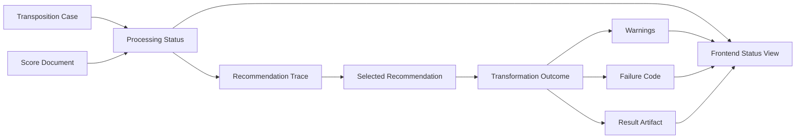

# Observability

Reference: [Architecture Index](./index.md)

## Purpose

This document defines how the system exposes runtime state, warnings, failures, and recommendation traceability for the MVP.

## Observability Goals

The MVP must make it possible to answer these questions:

- which transposition case was used for a score
- which uploaded MusicXML file was processed
- which recommendation set was generated
- which target range the user selected
- which processing step is currently active
- whether processing is queued in an asynchronous worker path or actively running
- whether warnings or failures occurred
- why a result should be considered trustworthy or uncertain
- which durable read endpoint exposes the current score-processing snapshot for the frontend

## Observability Flow Diagram

Diagram purpose:
Show which runtime signals and metadata artifacts make the processing flow observable from case selection through recommendation and final result delivery.

What to read from it:
Observability is not only job status. It also depends on traceable links between the active case, uploaded score, recommendation output, selected range, warnings, failures, and final artifact.

Why it belongs here:
This file owns runtime visibility, traceability, and the operational reading of processing state.

## Minimum Runtime States

Each processing flow should expose a typed status.

Recommended MVP states:

- `case_active`
- `score_uploaded`
- `uploaded`
- `queued`
- `parsing`
- `recommendation_pending`
- `recommendation_ready`
- `transformation_pending`
- `transforming`
- `completed`
- `failed`

These states should be visible to both backend operators and the frontend UI.

## Required Metadata

The system should persist enough metadata to identify:

- which case was active
- which score was processed
- which recommendation was used
- what status the processing flow reached
- whether the latest recommendation snapshot is stale because case constraints changed afterward
- whether warnings or failures occurred
- when processing started and ended

The authoritative field definitions belong in [Data Model](./data-model.md).

## Recommendation Traceability

AI-generated recommendations must remain inspectable after generation.

The MVP should store:

- the recommended ranges
- recommendation confidence
- recommendation explanations
- the case context used for recommendation
- the score document reference used for recommendation

This traceability is required so that a user can understand why a range was proposed and why one result may be more suitable than another.

## Confidence And Fallback Policy

Confidence must have operational meaning, not only descriptive value.

Recommended MVP confidence outcomes:

- `high`
  Recommendation may be shown as normal and may include a primary suggestion.
- `medium`
  Recommendation may be shown, but the UI should expose supporting explanation and any relevant warnings more prominently.
- `low`
  Recommendation may be shown only with explicit low-confidence signaling and should encourage regeneration, case editing, or follow-up clarification before the user continues.
- `blocked`
  Recommendation generation should stop and return a typed failure or follow-up requirement instead of offering a misleading selection.

Fallback expectations:

- low-confidence interview interpretation should trigger follow-up questioning before confirmed constraints are updated
- low-confidence recommendation output should never silently become a normal recommendation
- blocked recommendation confidence should surface as `RECOMMENDATION_FAILED` or an equivalent typed follow-up-needed state
- confidence policy should be traceable through stored recommendation metadata and visible UI state

## Warning Model

Warnings should be first-class metadata, not hidden log output.

Typical warnings include:

- notes near or outside the comfortable range
- unresolved ambiguity in target range selection
- low-confidence recommendation
- parsing recovery behavior
- export consistency issues

Warnings should be stored with enough structure that the frontend can show them clearly.

## Failure Model

Failures should be typed and attributable to a concrete processing step.

Recommended MVP failure classes:

- `INVALID_UPLOAD`
- `PARSE_ERROR`
- `RECOMMENDATION_FAILED`
- `TRANSFORMATION_FAILED`
- `EXPORT_FAILED`

The system should avoid generic unknown failures when a more precise type can be produced.

## UI Expectations

The frontend should expose at least:

- the current processing status
- the selected transposition case
- the recommendation result and confidence
- warnings that affect playability or output quality
- explicit failure messages when processing stops

The frontend should also distinguish between:

- blocking errors that stop the user from continuing
- recoverable errors that allow retry
- informational warnings that do not block selection or download

## Frontend State Mapping Expectations

The frontend should not invent state meaning on its own.
Case state, recommendation state, transformation state, and failure state should be interpreted from documented backend and observability signals.

The UI-facing state mapping for the MVP is documented in [Frontend State Mapping](./frontend-state-mapping.md).

## Storage Expectations

Observability metadata belongs in the metadata store, not only in ephemeral runtime logs.

Object storage keeps the source and output files.
The metadata store keeps statuses, identifiers, warnings, recommendation traces, and failure codes.

## Relationship To Other Documents

- [Overview](./overview.md) defines observability as a non-functional priority.
- [Module Design](./module-design.md) assigns status and warning responsibilities to the backend-facing modules.
- [Data Model](./data-model.md) defines `ProcessingJob`, `RangeRecommendation`, and `TransformationResult` as the main persistence anchors for observability.
