# Repository Structure

Related overview: [Architecture Overview](./overview.md)  
Related modules: [Module Design](./module-design.md)  
Related features: [Architecture Features](./features.md)  
Related task planning: [Overview](../tasks/overview.md)

## Purpose

This document defines a repository structure that supports both:

- clean implementation boundaries for the product architecture
- low-conflict work allocation for many junior developers

The structure is intentionally split first by major runtime responsibility and then by product feature or technical concern.

## Top-Level Structure

```text
frontend/
backend/
ai/
tests/
infra/
scripts/
docs/
assets/
```

## Repository Structure Diagram

```mermaid
flowchart TD
    ROOT[MusicApp Repository]
    ROOT --> FRONTEND[frontend/]
    ROOT --> BACKEND[backend/]
    ROOT --> AI[ai/]
    ROOT --> TESTS[tests/]
    ROOT --> INFRA[infra/]
    ROOT --> SCRIPTS[scripts/]
    ROOT --> DOCS[docs/]
    ROOT --> ASSETS[assets/]

    FRONTEND --> FE_FEATURES[features/]
    FRONTEND --> FE_SHARED[shared/]
    FRONTEND --> FE_APP[app/]

    BACKEND --> BE_API[api/]
    BACKEND --> BE_SERVICES[services/]
    BACKEND --> BE_WORKERS[workers/]
    BACKEND --> BE_DOMAIN[domain/]
    BACKEND --> BE_REPOS[repositories/]
    BACKEND --> BE_READMODELS[readmodels/]
    BACKEND --> BE_SECURITY[security/]

    AI --> AI_CAPS[capabilities/]
    AI --> AI_PROMPTS[prompting/]
    AI --> AI_EVAL[evaluations/]
    AI --> AI_PROVIDERS[providers/]

    TESTS --> TEST_UNIT[unit/]
    TESTS --> TEST_INT[integration/]
    TESTS --> TEST_E2E[e2e/]
    TESTS --> TEST_FIXTURES[fixtures/]
    TESTS --> TEST_SMOKE[smoke/]
```



Diagram purpose:
Show the preferred repository decomposition for implementation and delivery.

What to read from it:
Work is separated first by runtime responsibility. Inside those boundaries, feature work and shared utilities can be organized without mixing frontend, backend, AI, testing, and infrastructure concerns into the same folders.

Why it belongs here:
This file defines the implementation-facing repository layout that supports the approved architecture and the junior delivery plan.

## Recommended Detailed Layout

```text
frontend/
  app/
  features/
    cases/
    interview/
    upload/
    recommendations/
    transformation/
    results/
  components/
  shared/
    api/
    state/
    validation/
    ui/
  styles/

backend/
  api/
    routes/
    schemas/
  services/
    cases/
    interview/
    scores/
    recommendations/
    transformations/
    exports/
  workers/
    jobs/
    dispatch/
  domain/
    cases/
    scores/
    recommendations/
    transformations/
  repositories/
  readmodels/
  security/
  migrations/

ai/
  capabilities/
    interview/
    recommendation/
    evaluation/
  providers/
  prompting/
  schemas/
  fixtures/

tests/
  unit/
    frontend/
    backend/
    ai/
  integration/
    contracts/
    backend/
    ai/
  e2e/
  smoke/
  fixtures/

infra/
  environments/
    local/
    preview/
    production/
  ci/
  deployment/
  observability/

scripts/
  local/
  verification/
  maintenance/

assets/
  icons/
  reference-scores/
```

## Junior Work Allocation Rules

### Shared Principle

Juniors should usually receive tasks inside one leaf area, not across several top-level areas.

Preferred examples:

- one junior works in `frontend/features/recommendations/`
- one junior works in `backend/api/routes/`
- one junior works in `backend/readmodels/`
- one junior works in `tests/integration/contracts/`

Avoid for junior-only ownership:

- simultaneous edits across `frontend/`, `backend/`, and `ai/`
- shared ownership of the same schema file by many juniors at once
- direct parallel work in the same read-model or route file without explicit coordination

## Area Ownership Guidance

### `frontend/`

Use this area for user-facing UI logic only.

Good junior slicing:

- one junior per screen scaffold
- one junior per component family
- one junior per state hook or polling path

Avoid:

- mixing API contract definitions into UI component directories

### `backend/`

Use this area for request handling, orchestration, persistence, read models, and deterministic execution.

Good junior slicing:

- one junior on one route group
- one junior on one service area
- one junior on read-model normalization
- one junior on upload or presentation safety

Avoid:

- assigning the same route file to several juniors at the same time
- mixing worker dispatch and API route edits in one task unless explicitly necessary

### `ai/`

Use this area for model-facing logic only.

Good junior slicing:

- one junior on schema-constrained outputs
- one junior on provider adapters
- one junior on evaluation fixtures
- one junior on prompt-context shaping

Avoid:

- storing backend orchestration logic here
- placing raw experiments directly beside stable capability code

### `tests/`

This area is the main parallelization lane when many juniors are available.

Good junior slicing:

- separate contract tests from end-to-end tests
- separate smoke tests from domain integration tests
- separate fixtures from actual test cases

### `infra/`

Use this area for deployment and environment configuration.

Good junior slicing:

- one junior on preview deployment
- one junior on smoke verification
- one junior on observability wiring

Avoid:

- scattering environment files into `backend/` or `frontend/`

## Files That Should Stay Narrow

These areas are likely to become merge hotspots and should stay tightly controlled:

- `backend/api/schemas/`
- `backend/readmodels/`
- `frontend/shared/api/`
- `ai/schemas/`
- `tests/fixtures/`
- `infra/environments/production/`

Recommendation:
Only one actively assigned junior per hotspot file at a time, with review before parallel follow-up tasks start.

## Delivery Relationship

This structure should be used together with the delivery planning:

- [Overview](../tasks/overview.md)
- [Task Briefs Index](../tasks/task-briefs/index.md)

The delivery documents define who can work in parallel.
This document defines where that work should live in the repository.
