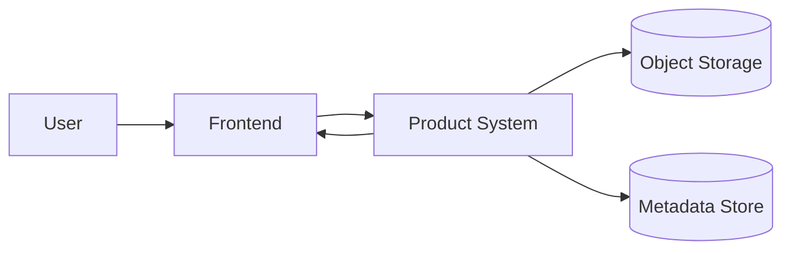

# System Context

Reference: [Architecture Index](./index.md)

## Product Goal

The system transposes uploaded music sheets into an optimal playable range for a selected instrument.
This document describes the external actors, system boundary, and end-to-end interaction flow.

## Actors

- User

## Primary Flow

1. A user completes an AI-guided questionnaire about the instrument and playable constraints.
2. The system creates or updates a persistent `TranspositionCase` for that instrument context.
3. The user uploads a MusicXML file into the selected case.
4. The system validates and parses the score.
5. The AI evaluates the uploaded score against the active case constraints and recommends one or more target ranges.
6. The user selects one of the recommended ranges.
7. The backend performs deterministic transposition into the selected range.
8. The system returns the transformed score and preserves the original version.
9. The user can download the output MusicXML and use it for printing or print it directly, depending on the frontend implementation.
10. Later uploads can reuse the same case until the user resets it or starts a new case for another instrument.

## MVP Scope

- input format: MusicXML only
- output format: MusicXML only
- target use case: transposition into an optimal playable range for a limited initial instrument set
- interaction mode: AI-guided interview before upload
- state model: constraints persist across multiple uploads inside the same case
- decision mode: AI recommends one or more target ranges, user chooses, backend executes deterministically

## System Boundary

Inside the product boundary:

- transposition case management
- questionnaire handling
- score parsing
- recommendation generation
- deterministic transposition
- export and metadata storage

Outside the product boundary:

- the human performer and their real-world playing ability
- the uploaded source file before ingestion
- future external integrations not yet part of the MVP

## System Context Diagram

## Boundary Decisions

- The frontend is responsible for questionnaire interaction, upload, recommendation display, user selection, and download.
- The backend owns validation, parsing coordination, deterministic transposition, persistence, and result delivery.
- Constraints are attached to a persistent case, not to a single uploaded file.
- The score parser is a dedicated domain component and must not be mixed directly into the API layer.
- The canonical score model is the stable internal representation for score analysis and transposition.
- AI owns recommendation and interview behavior, not direct score mutation.
- Instrument capability knowledge must be represented in a structured knowledge service instead of being left purely implicit inside the model.

## Document Role

This file explains who interacts with the system, which responsibilities sit inside the system boundary, and how the main runtime flow works.
Architectural principles and long-term design direction belong in [Overview](./overview.md).
Internal module relationships belong in [Module Design](./module-design.md).
