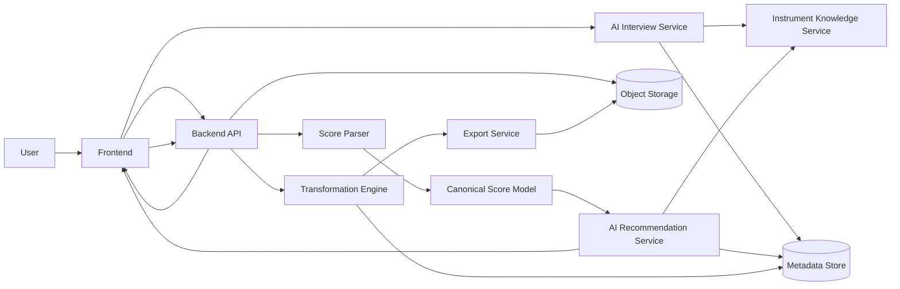

# System Context

Reference: [Architecture Index](./index.md)

## Product Goal

The system converts uploaded music sheets into a playable octave or range for a selected instrument.
The product starts as a focused converter and can later expand into a broader sheet-processing platform.

## Primary Flow

1. A user completes an AI-guided questionnaire about the instrument and playable constraints.
2. The system creates a structured instrument and player constraint profile.
3. The user uploads a MusicXML file.
4. The system validates and parses the score.
5. The AI evaluates the uploaded score against the constraint profile and recommends one or more target ranges.
6. The user selects one of the recommended ranges.
7. The backend performs deterministic transposition into the selected range.
8. The system returns the transformed score and preserves the original version.

## MVP Scope

- input format: MusicXML only
- output format: MusicXML only
- target use case: octave and range correction for a limited initial instrument set
- interaction mode: AI-guided interview before upload
- decision mode: AI recommends one or more target ranges, user chooses, backend executes deterministically

## System Context Diagram

## Boundary Decisions

- The frontend is responsible for questionnaire interaction, upload, recommendation display, user selection, and download.
- The backend owns validation, parsing coordination, deterministic transposition, persistence, and result delivery.
- The score parser is a dedicated domain component and must not be mixed directly into the API layer.
- The canonical score model is the stable internal representation for score analysis and transposition.
- AI owns recommendation and interview behavior, not direct score mutation.
- Instrument capability knowledge must be represented in a structured knowledge service instead of being left purely implicit inside the model.

## Platform Direction

The architecture intentionally separates questionnaire intelligence, instrument knowledge, score analysis, deterministic transposition, and export concerns.
This keeps the MVP explainable while preserving a path toward future capabilities such as richer performance profiles, additional score formats, batch workflows, and personalized recommendation quality.
