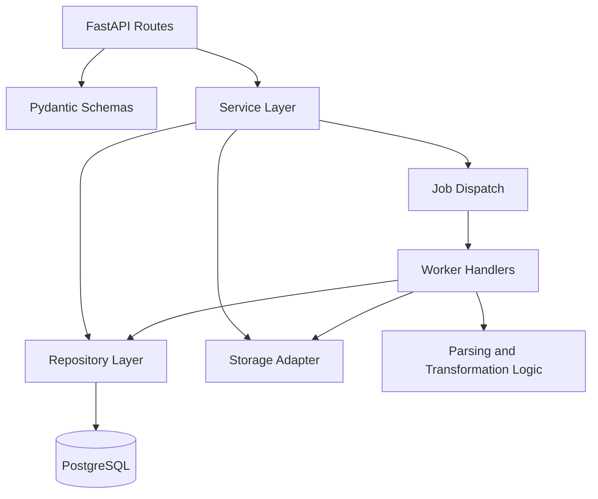

# Backend Application Structure

Reference: [Backend Index](./index.md)
Related architecture: [Module Design](../architecture/module-design.md)
Related interfaces: [Interfaces](../architecture/interfaces.md)
Related observability: [Observability](../architecture/observability.md)

## Purpose

This document defines the planned Python service structure for the MVP backend and maps the approved runtime modules to implementation-level backend packages.

## Planned Backend Areas

- `api`: route handlers and HTTP boundary logic
- `schemas`: request, response, and internal transfer models
- `services`: application-level orchestration for interviews, cases, parsing, recommendations, transformations, exports, and downloads
- `repositories`: persistence access for metadata entities
- `workers`: background-job entry points and job handlers
- `storage`: object-storage integration for score artifacts
- `db`: SQLAlchemy models, sessions, and migration integration
- `shared`: configuration, logging, error types, and common helpers

## Planned Directory Shape

```text
src/
  backend/
    api/
    schemas/
    services/
    repositories/
    workers/
    storage/
    db/
    shared/
```

## Backend Structure Diagram



Diagram purpose:
Show the planned implementation-level backend layering for the Python service and how request handling, service orchestration, persistence, storage, and job execution are separated.

What to read from it:
Route handlers should remain thin, services should own workflow coordination, repositories should isolate database access, and workers should execute long-running processing outside the request path.

Why it belongs here:
This file owns the internal backend application shape and how the approved architecture is translated into Python packages and service layers.

## Module Mapping To Architecture

- `api` implements the external `Backend API` boundary from the architecture.
- `services.interview` maps to backend coordination around the AI interview service.
- `services.cases` maps to the `Transposition Case Service`.
- `services.scores` and domain parsing logic map to the `Score Parser` path.
- `services.recommendations` coordinates backend-facing interaction with the AI recommendation path.
- `services.transformations` and `workers` map to the `Transformation Engine` execution path.
- `services.exports` and `storage` map to the `Export Service` and artifact persistence boundary.

## State Handling Plan

- Request-state validation should happen at the schema and service boundary, not inside route bodies.
- Processing-job state should be written to persistent metadata storage so retries and status reads remain observable.
- Long-running parsing, recommendation generation, transformation, and export should run in worker processes rather than blocking the request thread.
- Warning and failure metadata should be persisted in typed form so the frontend can render them without log scraping.

## Testing Priorities

- verify route-contract validation and typed error behavior
- verify case lifecycle persistence and reset behavior
- verify job creation and job-state transitions
- verify storage separation between metadata and score artifacts
- verify recommendation and transformation orchestration paths
