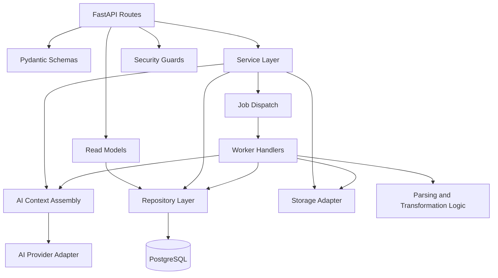

# Backend Application Structure

Reference: [Backend Index](./index.md)
Related architecture: [Module Design](../architecture/module-design.md)
Related interfaces: [Interfaces](../architecture/interfaces.md)
Related observability: [Observability](../architecture/observability.md)

## Purpose

This document defines the planned Python service structure for the MVP backend and maps the approved runtime modules to implementation-level backend packages.

## Planned Backend Areas

- `api`: route handlers and HTTP boundary logic
- `schemas`: request, response, and internal transfer models
- `services`: application-level orchestration for interviews, cases, parsing, recommendations, transformations, exports, and downloads
- `ai`: provider adapters, structured AI-call boundaries, and AI-context assembly helpers
- `readmodels`: frontend-facing status and summary assembly for cases, scores, recommendations, and transformations
- `repositories`: persistence access for metadata entities
- `workers`: background-job entry points and job handlers
- `storage`: object-storage integration for score artifacts
- `db`: SQLAlchemy models, sessions, and migration integration
- `shared`: configuration, logging, error types, and common helpers
- `security`: upload validation guards, presentation-safe error normalization, and boundary-protection helpers

## Planned Directory Shape

```text
src/
  backend/
    api/
    schemas/
    services/
    ai/
    readmodels/
    repositories/
    workers/
    storage/
    db/
    security/
    shared/
```

## Backend Structure Diagram



Diagram purpose:
Show the planned implementation-level backend layering for the Python service and how request handling, service orchestration, persistence, storage, and job execution are separated.

What to read from it:
Route handlers should remain thin, services should own workflow coordination, AI integration should stay behind explicit context-assembly and provider-adapter boundaries, repositories should isolate database access, and workers should execute long-running processing outside the request path.

Why it belongs here:
This file owns the internal backend application shape and how the approved architecture is translated into Python packages and service layers.

## Module Mapping To Architecture

- `api` implements the external `Backend API` boundary from the architecture.
- `services.interview` maps to backend coordination around the AI interview service.
- `services.cases` maps to the `Transposition Case Service`.
- `services.scores` and domain parsing logic map to the `Score Parser` path.
- `services.recommendations` coordinates backend-facing interaction with the AI recommendation path.
- `ai.context` assembles the `AI Context Contract` payloads required by interview and recommendation calls.
- `ai.providers` isolates model-provider-specific logic and schema-constrained AI calls.
- `readmodels.status` assembles frontend-facing score, recommendation, and transformation status snapshots from persistent metadata.
- `readmodels.presentation` normalizes warning severity, retryability, confidence signaling, and concise user-safe summaries without pushing visual design into the backend.
- `security.uploads` enforces file-type, size, and malformed-input protection before parser work begins.
- `security.presentation` ensures user-facing status payloads and failures remain presentation-safe and do not expose raw diagnostics.
- `services.transformations` and `workers` map to the `Transformation Engine` execution path.
- `services.exports` and `storage` map to the `Export Service` and artifact persistence boundary.

## State Handling Plan

- Request-state validation should happen at the schema and service boundary, not inside route bodies.
- Processing-job state should be written to persistent metadata storage so retries and status reads remain observable.
- Frontend polling should read dedicated status resources such as case, score, and transformation snapshots instead of inferring long-running state from mutation responses.
- Long-running parsing, recommendation generation, transformation, and export should run in worker processes rather than blocking the request thread.
- Case edits that change confirmed constraints should mark affected recommendation snapshots as stale in persisted read models.
- Warning and failure metadata should be persisted in typed form so the frontend can render them without log scraping.
- Read models should expose stable UI-facing semantics such as severity, retryability, confidence level, and short safe summaries so the frontend can render calm, structured status communication without reverse-engineering raw backend failures.
- Upload hardening should happen before parser execution and should reject unsupported, oversized, or malformed input as early as possible.
- Protected logs and internal telemetry may retain deeper technical diagnostics, but normal user-facing contracts and read models should remain minimal and presentation-safe.
- API and worker processes should tolerate independent deploy and restart cycles without relying on local in-memory state as the durable source of truth.

## Testing Priorities

- verify route-contract validation and typed error behavior
- verify case lifecycle persistence and reset behavior
- verify job creation and job-state transitions
- verify storage separation between metadata and score artifacts
- verify recommendation and transformation orchestration paths
- verify recommendation-context assembly keeps confirmed constraints, inferred constraints, and instrument knowledge distinguishable
- verify read models expose stable presentation metadata such as `severity`, `isRetryable`, `confidence`, and `safeSummary`
- verify upload hardening rejects unsupported, oversized, and malformed MusicXML before parser execution
- verify API and worker execution produce compatible persisted status and failure semantics
