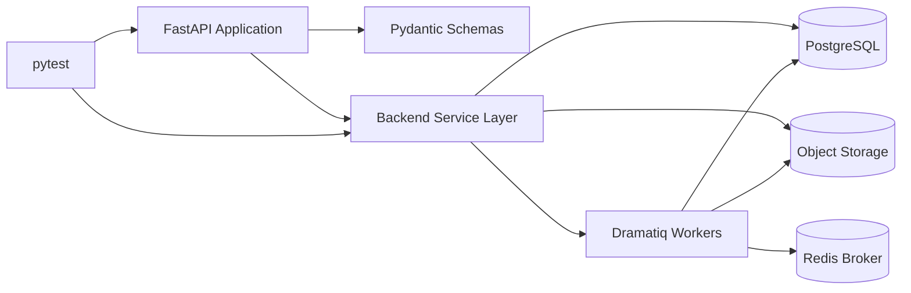

# Backend Implementation Plan

Reference: [Backend Index](./index.md)
Related architecture: [Architecture Overview](../architecture/overview.md)
Related modules: [Module Design](../architecture/module-design.md)
Related observability: [Observability](../architecture/observability.md)

## Purpose

This document defines the planned backend delivery stack for the MVP and explains how the approved architecture will be implemented with Python-based services and runtime tooling.

## Recommended Stack

- language: `Python`
- API framework: `FastAPI`
- schema and validation: `Pydantic v2`
- ORM and SQL access: `SQLAlchemy 2.x`
- migrations: `Alembic`
- primary metadata database: `PostgreSQL`
- object storage integration: S3-compatible storage abstraction
- background jobs: `Dramatiq`
- broker/runtime support for jobs: `Redis`
- test framework: `pytest`

## Stack Decision Notes

- `Python` is mandatory for this backend plan and fits well with AI integration, parsing workflows, and typed API delivery.
- `FastAPI` is the recommended MVP baseline because the system is API-first and depends on explicit request and response contracts.
- `Pydantic v2` should define API schemas and internal boundary models so contract drift remains visible.
- `SQLAlchemy 2.x` with `Alembic` is preferred for explicit persistence control and future schema evolution.
- `PostgreSQL` should own metadata, case state, recommendation records, processing jobs, and result references.
- S3-compatible object storage should own original and transformed score artifacts instead of storing file payloads in the relational database.
- `Dramatiq` with `Redis` is preferred over a custom in-process job loop because the architecture already assumes observable transformation jobs and typed runtime states.

## Backend Delivery Diagram

Diagram purpose:
Show the planned Python backend stack and how API delivery, typed schemas, persistence, artifact storage, and asynchronous jobs fit together.

What to read from it:
The backend is not a single undifferentiated service. The FastAPI layer exposes contracts, the service layer owns business behavior, PostgreSQL stores metadata, object storage keeps artifacts, and Dramatiq workers handle long-running processing.

Why it belongs here:
This file owns the concrete backend implementation stack and runtime tooling plan rather than the cross-domain architecture itself.

## Implementation Priorities

1. Set up the Python project structure, dependency management, and FastAPI application shell.
2. Implement typed API schemas and route groups for interviews, cases, scores, recommendations, transformations, and downloads.
3. Implement persistence models and migrations for cases, recommendation records, jobs, and result references.
4. Implement score and transformation read endpoints so the frontend can poll stable status snapshots during worker-driven flows.
5. Implement object-storage integration for original and transformed MusicXML artifacts.
6. Implement the background-job path for parsing, recommendation generation, deterministic transformation, and export.
7. Add structured logging, typed failure handling, recommendation-staleness tracking, and observable job-state persistence.
8. Add automated tests for API contracts, service behavior, persistence paths, and job-state transitions.

## Dependency Policy

- Prefer stable, explicit Python libraries over hidden framework magic.
- Keep AI-provider integration behind internal service boundaries rather than baking provider assumptions into route handlers.
- Avoid introducing a second task queue or ORM layer unless the current stack becomes insufficient.
- Treat synchronous shortcuts as temporary only if they do not violate the documented job-state model.
