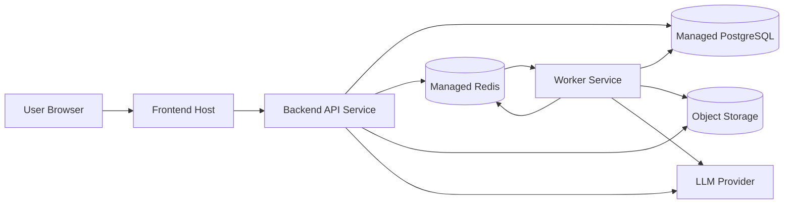

# MVP Deployment Model

Reference: [Cloud Index](./index.md)
Related architecture: [Architecture Overview](../architecture/overview.md)
Related modules: [Module Design](../architecture/module-design.md)
Related backend plan: [Backend Implementation Plan](../backend/implementation-plan.md)
Related frontend plan: [Frontend Implementation Plan](../frontend/implementation-plan.md)
Related observability: [Observability](../architecture/observability.md)

## Purpose

This document defines how the approved architecture should be deployed and operated for the MVP.
It favors a pragmatic cloud setup that is simple to run, easy to understand, and compatible with later hardening.

## Cloud Strategy For The MVP

The MVP should run as a small set of clearly separated managed runtime components:

- one frontend runtime
- one backend API runtime
- one worker runtime
- one managed PostgreSQL instance
- one managed Redis instance
- one object storage bucket or bucket group

The cloud model should avoid:

- an overly fragmented microservice platform
- Kubernetes-level complexity before product flow validation
- custom infrastructure for concerns already covered by managed services

## Recommended Hosting Shape

Recommended baseline:

- frontend on a managed web platform
- backend API as a containerized service
- worker as a separate containerized service
- managed PostgreSQL
- managed Redis
- S3-compatible object storage

Adapted recommendation for this project:

- `Frontend`: Vercel or another managed Next.js-friendly web host
- `Backend API`: container service such as Railway, Render, Fly.io, or a managed container platform on a major cloud
- `Worker Runtime`: separate service on the same platform family as the backend API
- `Database`: managed PostgreSQL
- `Broker`: managed Redis
- `Artifacts`: S3-compatible object storage such as AWS S3, Cloudflare R2, or equivalent

The exact vendor may vary, but the runtime separation should stay the same.

## Deployment Topology Diagram

Diagram purpose:
Show the recommended MVP deployment topology and the runtime separation between frontend delivery, synchronous API handling, asynchronous workers, stateful managed services, artifact storage, and external AI providers.

What to read from it:
The MVP should not collapse API and worker execution into a single opaque runtime. The frontend calls the backend API, the backend coordinates state and dispatches background work through the broker path, and both API and worker rely on managed stateful services plus an external AI provider.

Why it belongs here:
This file owns cloud deployment and runtime planning rather than application-internal module behavior.

## Runtime Responsibilities

### Frontend Host

Responsibilities:

- serve the Next.js application
- terminate browser-facing HTTPS
- provide environment-scoped frontend configuration
- call the backend API only through configured endpoints

MVP expectation:
The frontend should remain stateless and easily redeployable.

### Backend API Service

Responsibilities:

- serve public API routes
- validate requests
- enforce upload and presentation-safety boundaries
- write metadata state
- dispatch long-running work to the worker runtime

MVP expectation:
The API service should stay horizontally replaceable and should not own local persistent state.

### Worker Service

Responsibilities:

- execute parsing, recommendation generation, transformation, and export jobs
- update persistent job and score status
- write warnings and failure metadata

MVP expectation:
The worker must be deployable independently from the API so background work does not compete with request handling.

### Managed PostgreSQL

Responsibilities:

- store cases
- store recommendations
- store jobs and transformation metadata
- store references to artifacts

MVP expectation:
Use managed backups and basic availability features rather than self-hosting the database.

### Managed Redis

Responsibilities:

- support the job queue and broker behavior
- coordinate worker dispatch and retry signaling where needed
- carry the broker path between API-side dispatch and worker-side execution

MVP expectation:
Treat Redis as ephemeral infrastructure state, not as the source of truth for durable processing results.

### Object Storage

Responsibilities:

- store original score artifacts
- store transformed MusicXML artifacts
- keep source and output objects separate

MVP expectation:
Artifacts should never depend on container-local disk for durable persistence.

## Environment Model

Recommended environments:

- `local`
- `preview`
- `production`

### Local

Purpose:
Developer workflow and integration testing.

Recommended shape:

- local frontend dev server
- local backend API
- local worker
- local Postgres and Redis through containers
- object storage emulator or dedicated dev bucket

### Preview

Purpose:
Validate branch builds and integration behavior before production.
Support product, design, and UX review before release.

Recommended shape:

- ephemeral frontend deployment per branch or PR
- shared or isolated preview backend depending on platform cost
- isolated preview environment variables
- preview URLs stable enough to share in design and stakeholder review

### Production

Purpose:
Run the MVP for real users.

Recommended shape:

- stable frontend deployment
- one API service
- one worker service
- managed stateful services with backups enabled

## Secrets And Configuration

Required secret classes:

- database connection string
- Redis connection string
- object storage credentials
- AI provider credentials
- application signing or session secrets when introduced

Rules:

- never hardcode secrets in application code
- store secrets in platform-managed secret stores
- separate secrets by environment
- rotate AI and storage credentials when exposure is suspected
- prefer least-privilege credentials for object storage and AI-provider access

## Deployment Pipeline Expectations

Recommended pipeline stages:

1. install dependencies
2. run linting and tests
3. build frontend and backend artifacts
4. deploy preview or production target
5. run basic post-deploy health verification

Minimum verification after deploy:

- frontend-to-backend connectivity check
- API health verification
- worker liveness verification
- one status-read smoke check against the deployed environment

MVP recommendation:
Keep CI/CD simple and linear.
Do not introduce complex multi-stage release orchestration until release frequency or team size justifies it.

## Health And Operations

The cloud setup should support:

- API health endpoint
- worker liveness monitoring
- database availability monitoring
- Redis availability monitoring
- object storage access verification
- job backlog visibility

Operational baseline:

- logs from API and worker should be centralized
- errors should be searchable by job or request identifiers
- alerting can remain lightweight in the MVP, but total silence on failure is not acceptable
- API and worker should support graceful restart behavior so deploys do not silently discard active job truth

Testing expectation:

- preview environments should be usable for smoke testing the full case-to-download path before production promotion
- production deploys should be blocked when the basic post-deploy verification fails

## Scaling Expectations

The MVP should scale by runtime separation first:

- scale frontend independently from backend
- scale API independently from worker
- scale worker based on queue pressure

Do not optimize for large-scale throughput before the product flow is validated.
But do preserve the ability to scale worker count without redesigning the application.

## Storage And Data Handling Rules

- original and transformed artifacts must stay separate
- metadata stays in PostgreSQL, not in object storage
- Redis must not become the durable source of truth
- local container disks must not be treated as durable artifact storage

## Reliability Rules

- frontend must tolerate temporary API failure with explicit UI states
- worker restarts must not erase durable job truth
- object storage outage should fail visibly rather than producing phantom success
- background work should be resumable through persisted job metadata where possible

## Security And Safety Alignment

Cloud deployment must preserve the safety boundaries defined elsewhere:

- uploads reach the backend validation boundary before parser execution
- raw diagnostics should stay in protected logs, not in user-facing responses
- AI provider credentials must remain server-side only
- object storage should not be exposed as a public write surface
- storage buckets should default to private access and scoped service credentials
- secrets and logs should remain platform-protected rather than exposed through client-side configuration

## AI Runtime Expectations

- API and worker runtimes should share the same provider configuration model so AI behavior does not drift by environment or runtime path
- AI provider timeouts and retry limits should be centrally configured rather than hardcoded per call site
- outbound provider access should remain server-side only and should be observable for failure diagnosis

## MVP To Production Growth Path

Reasonable next upgrades after MVP validation:

- dedicated background monitoring and alerting
- private networking between services where supported
- stricter backup and restore testing
- CDN and caching strategy for frontend assets
- more explicit rate limiting and abuse protection at the API boundary
- stronger deployment rollback automation

## Ownership

- `Cloud` owns deployment model, environment strategy, and runtime topology
- `Backend` owns deployable service behavior and infrastructure assumptions inside the backend runtime
- `Frontend` owns frontend build and runtime expectations
- `Architect` owns structural alignment between runtime topology and system architecture
- `Safety` owns cloud-relevant safety concerns when data exposure or trust-boundary risks become material
