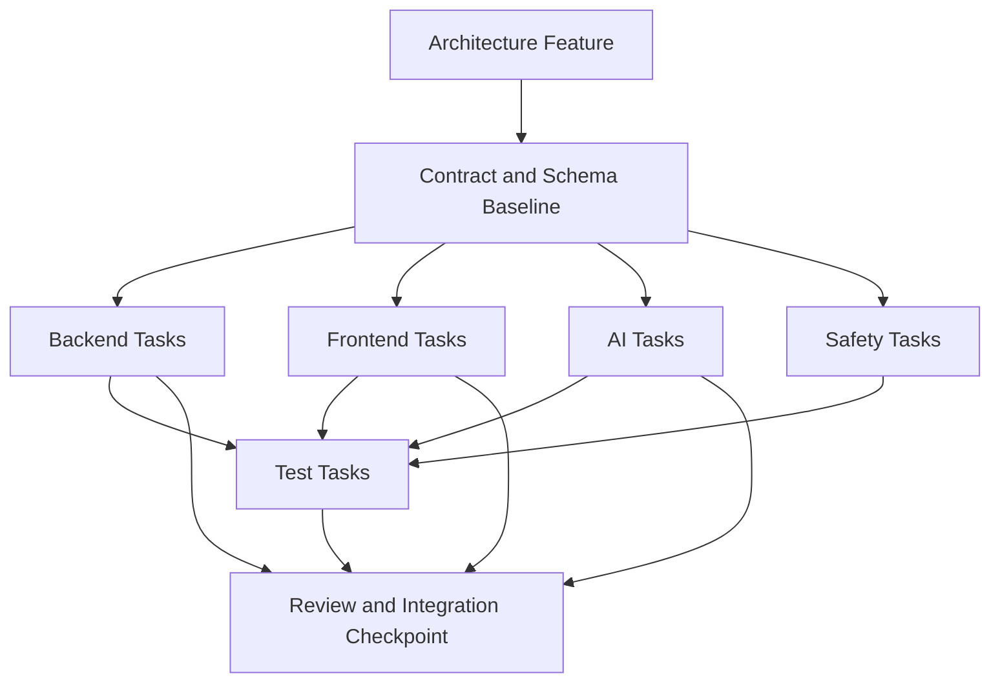

# Junior Task Breakdown

Reference: [Delivery Index](./index.md)
Detailed briefs: [Task Briefs Index](./task-briefs/index.md)
Related features: [Architecture Features](../architecture/features.md)
Related frontend plan: [Frontend Implementation Plan](../frontend/implementation-plan.md)
Related backend plan: [Backend Implementation Plan](../backend/implementation-plan.md)
Related AI plan: [AI Implementation Plan](../ai/implementation-plan.md)
Related cloud plan: [MVP Deployment Model](../cloud/mvp-deployment-model.md)
Related safety model: [MVP Safety Model](../safety/mvp-safety-model.md)
Related test strategy: [MVP Test Strategy](../test/mvp-test-strategy.md)

## Purpose

This document translates the approved MVP features into junior-friendly work packages.
It is intended for teams with many junior developers and assumes that tasks should stay small, concrete, and easy to review.

## Task Slicing Principles

- prefer many small tasks over a few broad ownership areas
- keep most tasks within a single domain such as frontend, backend, AI, test, cloud, or safety
- size tasks so that a junior developer can usually complete them in roughly half a day to two days
- keep contracts and architecture decisions outside the task unless the task is explicitly about implementing an already approved contract
- use test and verification tasks as a major parallelization lane when implementation ownership would otherwise collide

## Delivery Decomposition Diagram

Diagram purpose:
Show the normal execution shape for one feature when many juniors work in parallel.

What to read from it:
Most features should begin with a small contract or schema baseline. After that, frontend, backend, AI, and safety tasks can often run in parallel, while test tasks expand as soon as the first implementation outputs are available. Work should reconverge at a review and integration checkpoint instead of drifting independently.

Why it belongs here:
This file owns delivery-task decomposition and parallel execution planning rather than architecture boundaries.

## Parallelization Legend

- `[Parallel now]`: can start immediately within the feature without waiting for another task in the same feature
- `[After contract]`: should start after the relevant request, response, or schema boundary is fixed
- `[After backend]`: should start after the required backend contract or backend state exists
- `[After AI schema]`: should start after the AI input or output schema is fixed
- `[After read model]`: should start after the relevant status or read-model payload exists
- `[After deploy setup]`: should start after the required preview or deployment baseline exists
- `[Integration checkpoint]`: should be reviewed only after the preceding implementation tasks are in place

## Staffing Guidance

- Do not assign one full feature to one junior developer unless the feature is already internally split and reviewed.
- Prefer parallelization through `Test` tasks and small domain-specific work items rather than by increasing the number of active architecture features.
- Freeze contracts before several juniors start work against the same route or read model.
- Use one reviewer or integration owner per active feature area.

## Relationship To Detailed Task Briefs

This document stays as the compact allocation overview.
Detailed assignable briefs for every task live in [Task Briefs Index](./task-briefs/index.md).

## [F1. Case Entry](./task-briefs/f1-f4.md#f1-case-entry)

Goal:
Let the user create a new transposition case or continue an existing active one.

Tasks:

- [`Frontend-1`](./task-briefs/f1-f4.md#frontend-1) `[Parallel now]` Create the case-entry screen scaffold.
- [`Frontend-2`](./task-briefs/f1-f4.md#frontend-2) `[After contract]` Render the list of existing cases.
- [`Frontend-3`](./task-briefs/f1-f4.md#frontend-3) `[After contract]` Highlight the most recently used active case as the default suggestion.
- [`Frontend-4`](./task-briefs/f1-f4.md#frontend-4) `[After contract]` Wire the "create new case" action.
- [`Backend-1`](./task-briefs/f1-f4.md#backend-1) `[Parallel now]` Implement the basic `POST /cases` route.
- [`Backend-2`](./task-briefs/f1-f4.md#backend-2) `[Parallel now]` Implement the basic `GET /cases/{id}` route.
- [`Backend-3`](./task-briefs/f1-f4.md#backend-3) `[Parallel now]` Define the case-summary response schema.
- [`Test-1`](./task-briefs/f1-f4.md#test-1) `[After contract]` Add a contract test for `POST /cases`.
- [`Test-2`](./task-briefs/f1-f4.md#test-2) `[After contract]` Add a contract test for `GET /cases/{id}`.
- [`Test-3`](./task-briefs/f1-f4.md#test-3) `[After backend]` Add a UI test for default-case selection behavior.

Parallelization note:
`Backend-1`, `Backend-2`, `Backend-3`, and `Frontend-1` can start immediately. The rest should follow once the case contract is stable.

## [F2. Structured Interview Session](./task-briefs/f1-f4.md#f2-structured-interview-session)

Goal:
Run the AI-guided question flow that collects instrument and playability constraints.

Tasks:

- [`AI-1`](./task-briefs/f1-f4.md#ai-1) `[Parallel now]` Define the question object schema.
- [`AI-2`](./task-briefs/f1-f4.md#ai-2) `[Parallel now]` Define the answer payload schema.
- [`AI-3`](./task-briefs/f1-f4.md#ai-3) `[After AI schema]` Define follow-up rules for incomplete or ambiguous answers.
- [`AI-4`](./task-briefs/f1-f4.md#ai-4) `[After AI schema]` Define low-confidence interview behavior.
- [`Backend-4`](./task-briefs/f1-f4.md#backend-4) `[After AI schema]` Implement the `POST /interviews` route.
- [`Backend-5`](./task-briefs/f1-f4.md#backend-5) `[After AI schema]` Implement the `GET /interviews/{id}` route.
- [`Backend-6`](./task-briefs/f1-f4.md#backend-6) `[After AI schema]` Add interview-session persistence.
- [`Frontend-5`](./task-briefs/f1-f4.md#frontend-5) `[Parallel now]` Create the interview screen scaffold.
- [`Frontend-6`](./task-briefs/f1-f4.md#frontend-6) `[After contract]` Render single-select questions.
- [`Frontend-7`](./task-briefs/f1-f4.md#frontend-7) `[After contract]` Render multi-select questions.
- [`Frontend-8`](./task-briefs/f1-f4.md#frontend-8) `[After contract]` Render range and note inputs.
- [`Frontend-9`](./task-briefs/f1-f4.md#frontend-9) `[After contract]` Wire submit and progress state behavior.
- [`Backend-6a`](./task-briefs/f1-f4.md#backend-6a) `[After backend]` Add a provisional case-delete endpoint for local MVP cleanup.
- [`Frontend-9a`](./task-briefs/f1-f4.md#frontend-9a) `[After backend]` Add a provisional delete action for `Other cases` only.
- [`Test-4`](./task-briefs/f1-f4.md#test-4) `[After contract]` Add contract tests for interview endpoints.
- [`Test-5`](./task-briefs/f1-f4.md#test-5) `[After backend]` Add UI tests for multiple question types.
- [`Test-6`](./task-briefs/f1-f4.md#test-6) `[After backend]` Add a follow-up test for low-confidence handling.
- [`Test-6a`](./task-briefs/f1-f4.md#test-6a) `[After frontend]` Add regression tests for the provisional delete flow.
- [`Safety-1`](./task-briefs/f1-f4.md#safety-1) `[After AI schema]` Review that structured questions remain preferred over default free-text collection.

Parallelization note:
Start with `AI-1`, `AI-2`, and `Frontend-5`. Once the question and answer contract is stable, split work across backend, frontend renderers, safety review, and test. The provisional cleanup routine should follow the stable case-list path and remain explicitly temporary.

## [F3. Case Readiness And Persistence](./task-briefs/f1-f4.md#f3-case-readiness-and-persistence)

Goal:
Store confirmed case constraints and expose when a case is ready for upload.

Tasks:

- [`Backend-7`](./task-briefs/f1-f4.md#backend-7) `[Parallel now]` Implement the case-status model.
- [`Backend-8`](./task-briefs/f1-f4.md#backend-8) `[Parallel now]` Persist confirmed constraints.
- [`Backend-9`](./task-briefs/f1-f4.md#backend-9) `[After contract]` Implement `ready_for_upload` logic.
- [`Backend-10`](./task-briefs/f1-f4.md#backend-10) `[After contract]` Separate multiple user cases cleanly by instrument context.
- [`AI-5`](./task-briefs/f1-f4.md#ai-5) `[After AI schema]` Ensure outputs keep confirmed and inferred constraints distinct.
- [`Test-7`](./task-briefs/f1-f4.md#test-7) `[After backend]` Add a status-transition test from `interview_in_progress` to `ready_for_upload`.
- [`Test-8`](./task-briefs/f1-f4.md#test-8) `[After backend]` Add a test for confirmed-vs-inferred constraint separation.
- [`Test-9`](./task-briefs/f1-f4.md#test-9) `[After backend]` Add a test for multiple cases owned by the same user.

Parallelization note:
Most backend persistence tasks can start together. `AI-5` and the tests should follow once the confirmed-vs-inferred boundary is visible.

## [F4. MusicXML Upload Acceptance](./task-briefs/f1-f4.md#f4-musicxml-upload-acceptance)

Goal:
Accept a MusicXML upload that is linked to a ready transposition case.

Tasks:

- [`Backend-11`](./task-briefs/f1-f4.md#backend-11) `[Parallel now]` Implement the `POST /scores` route.
- [`Backend-12`](./task-briefs/f1-f4.md#backend-12) `[Parallel now]` Add multipart upload handling.
- [`Backend-13`](./task-briefs/f1-f4.md#backend-13) `[After contract]` Validate `transpositionCaseId` binding.
- [`Backend-14`](./task-briefs/f1-f4.md#backend-14) `[After contract]` Return the initial score-processing snapshot.
- [`Safety-2`](./task-briefs/f1-f4.md#safety-2) `[Parallel now]` Validate allowed upload file types.
- [`Safety-3`](./task-briefs/f1-f4.md#safety-3) `[Parallel now]` Validate file size limits.
- [`Safety-4`](./task-briefs/f1-f4.md#safety-4) `[Parallel now]` Reject malformed input early.
- [`Frontend-10`](./task-briefs/f1-f4.md#frontend-10) `[Parallel now]` Build the upload UI.
- [`Frontend-11`](./task-briefs/f1-f4.md#frontend-11) `[After backend]` Block upload while the case is not ready.
- [`Test-10`](./task-briefs/f1-f4.md#test-10) `[After backend]` Add a test for upload rejection when the case is not ready.
- [`Test-11`](./task-briefs/f1-f4.md#test-11) `[After backend]` Add a test for unsupported file types.
- [`Test-12`](./task-briefs/f1-f4.md#test-12) `[After backend]` Add a test for oversized uploads.
- [`Test-13`](./task-briefs/f1-f4.md#test-13) `[After backend]` Add a test for valid upload acceptance.

Parallelization note:
This feature parallelizes well: backend route work, safety upload rules, and upload UI scaffold can all start immediately.

## [F5. Score Parsing](./task-briefs/f5-f8.md#f5-score-parsing)

Goal:
Turn the uploaded MusicXML file into the canonical score model.

Tasks:

- [`Backend-15`](./task-briefs/f5-f8.md#backend-15) `[Parallel now]` Add a parser wrapper.
- [`Backend-16`](./task-briefs/f5-f8.md#backend-16) `[After contract]` Implement canonical-score mapping.
- [`Backend-17`](./task-briefs/f5-f8.md#backend-17) `[After contract]` Persist parse-success state.
- [`Backend-18`](./task-briefs/f5-f8.md#backend-18) `[After contract]` Define typed parse failures.
- [`Test-14`](./task-briefs/f5-f8.md#test-14) `[After backend]` Add a parser test with valid MusicXML.
- [`Test-15`](./task-briefs/f5-f8.md#test-15) `[After backend]` Add a parser test with invalid MusicXML.
- [`Test-16`](./task-briefs/f5-f8.md#test-16) `[After backend]` Add a test for typed parse-failure state.
- [`Test-17`](./task-briefs/f5-f8.md#test-17) `[After backend]` Add a test for canonical-score persistence.

Parallelization note:
Parsing tasks are mostly backend-first. Once the parser wrapper and failure contract exist, tests can fan out quickly.

## [F6. Recommendation Context Assembly](./task-briefs/f5-f8.md#f6-recommendation-context-assembly)

Goal:
Assemble the backend-owned context needed for AI recommendation.

Tasks:

- [`Backend-19`](./task-briefs/f5-f8.md#backend-19) `[Parallel now]` Add confirmed case constraints to the recommendation context.
- [`Backend-20`](./task-briefs/f5-f8.md#backend-20) `[Parallel now]` Add inferred constraints only as advisory context.
- [`Backend-21`](./task-briefs/f5-f8.md#backend-21) `[Parallel now]` Add instrument-knowledge context.
- [`Backend-22`](./task-briefs/f5-f8.md#backend-22) `[Parallel now]` Add canonical-score summary context.
- [`AI-6`](./task-briefs/f5-f8.md#ai-6) `[Parallel now]` Define the expected recommendation-input schema.
- [`Test-18`](./task-briefs/f5-f8.md#test-18) `[After backend]` Add a test for context assembly with confirmed constraints.
- [`Test-19`](./task-briefs/f5-f8.md#test-19) `[After backend]` Add a test for advisory inferred constraints.
- [`Test-20`](./task-briefs/f5-f8.md#test-20) `[After backend]` Add edge-case tests for missing or partial instrument knowledge.
- [`Test-21`](./task-briefs/f5-f8.md#test-21) `[After backend]` Add a regression test that confirmed and inferred constraints do not collapse into one source.

Parallelization note:
This feature is highly parallelizable inside the backend, but all test tasks should wait until the final context shape is visible.

## [F7. Recommendation Generation](./task-briefs/f5-f8.md#f7-recommendation-generation)

Goal:
Produce one or more recommended target ranges for the uploaded score.

Tasks:

- [`AI-7`](./task-briefs/f5-f8.md#ai-7) `[Parallel now]` Define the recommendation output schema.
- [`AI-8`](./task-briefs/f5-f8.md#ai-8) `[After AI schema]` Define primary-versus-secondary recommendation logic.
- [`AI-9`](./task-briefs/f5-f8.md#ai-9) `[After AI schema]` Map recommendation confidence to `high`, `medium`, `low`, and `blocked`.
- [`AI-10`](./task-briefs/f5-f8.md#ai-10) `[After AI schema]` Define the warning structure.
- [`AI-11`](./task-briefs/f5-f8.md#ai-11) `[After AI schema]` Implement blocked-confidence failure behavior.
- [`Backend-23`](./task-briefs/f5-f8.md#backend-23) `[After AI schema]` Wire the `POST /recommendations` route.
- [`Backend-24`](./task-briefs/f5-f8.md#backend-24) `[After AI schema]` Persist recommendation results.
- [`Test-22`](./task-briefs/f5-f8.md#test-22) `[After backend]` Add a contract test for the recommendation payload.
- [`Test-23`](./task-briefs/f5-f8.md#test-23) `[After backend]` Add a test for primary and secondary recommendation output.
- [`Test-24`](./task-briefs/f5-f8.md#test-24) `[After backend]` Add a low-confidence recommendation test.
- [`Test-25`](./task-briefs/f5-f8.md#test-25) `[After backend]` Add a blocked-confidence recommendation test.
- [`Safety-5`](./task-briefs/f5-f8.md#safety-5) `[After backend]` Review that raw provider text never becomes normal user-facing output.

Parallelization note:
`AI-7` should happen first. After that, AI behavior, backend integration, and later tests can run in parallel.

## [F8. Recommendation Review And Selection](./task-briefs/f5-f8.md#f8-recommendation-review-and-selection)

Goal:
Let the user inspect recommendation options and explicitly choose one.

Tasks:

- [`Frontend-12`](./task-briefs/f5-f8.md#frontend-12) `[Parallel now]` Create the recommendation-review screen scaffold.
- [`Frontend-13`](./task-briefs/f5-f8.md#frontend-13) `[After backend]` Build the primary recommendation card.
- [`Frontend-14`](./task-briefs/f5-f8.md#frontend-14) `[After backend]` Build the secondary recommendation card.
- [`Frontend-15`](./task-briefs/f5-f8.md#frontend-15) `[After backend]` Render warnings.
- [`Frontend-16`](./task-briefs/f5-f8.md#frontend-16) `[After backend]` Render confidence indicators.
- [`Frontend-17`](./task-briefs/f5-f8.md#frontend-17) `[After backend]` Wire the selection action.
- [`Designer-1`](./task-briefs/f5-f8.md#designer-1) `[Parallel now]` Finalize layout rules for primary versus secondary recommendation cards.
- [`Test-26`](./task-briefs/f5-f8.md#test-26) `[After backend]` Add a UI test for recommendation selection.
- [`Test-27`](./task-briefs/f5-f8.md#test-27) `[After backend]` Add a UI test for low-confidence rendering.
- [`Test-28`](./task-briefs/f5-f8.md#test-28) `[After backend]` Add a UI test for warning rendering.

Parallelization note:
`Frontend-12` and `Designer-1` can start immediately. The card-specific implementation tasks should wait for the final recommendation payload.

## [F8b. Safe Score Preview And Result Comparison](./task-briefs/f8b-score-preview.md#f8b-safe-score-preview-and-result-comparison)

Goal:
Let the user inspect the uploaded score before transformation and inspect the result score only after exported result artifacts are available.

Tasks:

- [`Architect-1`](./task-briefs/f8b-score-preview.md#architect-1) `[Parallel now]` Define the preview boundary, route placement, and safety constraints.
- [`Backend-25a`](./task-briefs/f8b-score-preview.md#backend-25a) `[After architecture]` Expose source-score preview availability and safe preview metadata.
- [`Backend-25b`](./task-briefs/f8b-score-preview.md#backend-25b) `[After architecture]` Expose result-score preview availability and safe preview metadata.
- [`Frontend-17a`](./task-briefs/f8b-score-preview.md#frontend-17a) `[After architecture]` Create the preview workspace scaffold.
- [`Frontend-17b`](./task-briefs/f8b-score-preview.md#frontend-17b) `[After backend]` Add source-score preview rendering.
- [`Frontend-17c`](./task-briefs/f8b-score-preview.md#frontend-17c) `[After backend]` Add result-score preview rendering.
- [`Frontend-17d`](./task-briefs/f8b-score-preview.md#frontend-17d) `[After backend]` Add the `Original` versus `Result` toggle or comparison mode.
- [`Safety-5a`](./task-briefs/f8b-score-preview.md#safety-5a) `[After architecture]` Review that the preview stays read-only and presentation-safe.
- [`Test-28a`](./task-briefs/f8b-score-preview.md#test-28a) `[After frontend]` Add a UI test for source-score preview.
- [`Test-28b`](./task-briefs/f8b-score-preview.md#test-28b) `[After frontend]` Add a UI test for result-score preview and preview failure states.

Parallelization note:
Architecture and safety boundaries should be agreed first. Source preview can proceed after that. Result preview work must wait for the approved result-artifact and read-model contract from later delivery stages.

## [F9. Deterministic Transformation](./task-briefs/f9-f12.md#f9-deterministic-transformation)

Goal:
Apply the selected target range through backend-owned deterministic transposition.

Tasks:

- [`Backend-25`](./task-briefs/f9-f12.md#backend-25) `[Parallel now]` Implement the `POST /transformations` route.
- [`Backend-26`](./task-briefs/f9-f12.md#backend-26) `[Parallel now]` Validate selected recommendation input.
- [`Backend-27`](./task-briefs/f9-f12.md#backend-27) `[Parallel now]` Create the transformation-engine scaffold.
- [`Backend-28`](./task-briefs/f9-f12.md#backend-28) `[After contract]` Implement range adaptation logic.
- [`Backend-29`](./task-briefs/f9-f12.md#backend-29) `[After contract]` Emit warnings when adaptation is not clean.
- [`Test-29`](./task-briefs/f9-f12.md#test-29) `[After backend]` Add a contract test for transformation requests.
- [`Test-30`](./task-briefs/f9-f12.md#test-30) `[After backend]` Add a test for successful transformation.
- [`Test-31`](./task-briefs/f9-f12.md#test-31) `[After backend]` Add a warning-emission test.
- [`Test-32`](./task-briefs/f9-f12.md#test-32) `[After backend]` Add a test that transformation never executes directly from raw AI text.

Parallelization note:
The transformation scaffold, route, and selection validation can start together. Deep logic and tests should follow the stabilized execution contract.

## [F10. Result Export](./task-briefs/f9-f12.md#f10-result-export)

Goal:
Convert transformed score data into output MusicXML and store the result artifact.

Tasks:

- [`Backend-30`](./task-briefs/f9-f12.md#backend-30) `[Parallel now]` Create the export-service scaffold.
- [`Backend-31`](./task-briefs/f9-f12.md#backend-31) `[After contract]` Implement MusicXML output generation.
- [`Backend-32`](./task-briefs/f9-f12.md#backend-32) `[After contract]` Add export-consistency validation.
- [`Backend-33`](./task-briefs/f9-f12.md#backend-33) `[After contract]` Persist output-artifact references.
- [`Test-33`](./task-briefs/f9-f12.md#test-33) `[After backend]` Add a valid-export test.
- [`Test-34`](./task-briefs/f9-f12.md#test-34) `[After backend]` Add an export-consistency failure test.
- [`Test-35`](./task-briefs/f9-f12.md#test-35) `[After backend]` Add a test that source and output artifacts remain separated.

Parallelization note:
The export-service scaffold can start alone, but the rest depends on stable transformation output shape.

## [F11. Processing Status Visibility](./task-briefs/f9-f12.md#f11-processing-status-visibility)

Goal:
Expose durable frontend-readable status snapshots for score and transformation flows.

Tasks:

- [`Backend-34`](./task-briefs/f9-f12.md#backend-34) `[Parallel now]` Implement `GET /scores/{id}` fully.
- [`Backend-35`](./task-briefs/f9-f12.md#backend-35) `[Parallel now]` Implement `GET /transformations/{id}` fully.
- [`Backend-36`](./task-briefs/f9-f12.md#backend-36) `[Parallel now]` Implement typed status mapping.
- [`Backend-37`](./task-briefs/f9-f12.md#backend-37) `[After read model]` Expose `severity` presentation metadata.
- [`Backend-38`](./task-briefs/f9-f12.md#backend-38) `[After read model]` Expose `isRetryable` presentation metadata.
- [`Backend-39`](./task-briefs/f9-f12.md#backend-39) `[After read model]` Expose `confidence` presentation metadata.
- [`Backend-40`](./task-briefs/f9-f12.md#backend-40) `[After read model]` Expose `safeSummary` presentation metadata.
- [`Frontend-18`](./task-briefs/f9-f12.md#frontend-18) `[After backend]` Wire score-status polling.
- [`Frontend-19`](./task-briefs/f9-f12.md#frontend-19) `[After backend]` Wire transformation-status polling.
- [`Frontend-20`](./task-briefs/f9-f12.md#frontend-20) `[After read model]` Render `queued`, `parsing`, `transforming`, `completed`, and `failed` states.
- [`Test-36`](./task-briefs/f9-f12.md#test-36) `[After read model]` Add read-model contract tests.
- [`Test-37`](./task-briefs/f9-f12.md#test-37) `[After read model]` Add a test for the full status sequence.
- [`Test-38`](./task-briefs/f9-f12.md#test-38) `[After read model]` Add a test for presentation-safe metadata.
- [`Safety-6`](./task-briefs/f9-f12.md#safety-6) `[After read model]` Review that raw diagnostics are not exposed in user-facing status payloads.

Parallelization note:
Start with status routes and base status mapping. Frontend polling, metadata rendering, and most tests should wait for the read-model shape.

## [F12. Result Download](./task-briefs/f9-f12.md#f12-result-download)

Goal:
Let the user download the transformed MusicXML result.

Tasks:

- [`Frontend-21`](./task-briefs/f9-f12.md#frontend-21) `[Parallel now]` Create the result screen scaffold.
- [`Frontend-22`](./task-briefs/f9-f12.md#frontend-22) `[After backend]` Wire the download button.
- [`Backend-41`](./task-briefs/f9-f12.md#backend-41) `[Parallel now]` Complete the download endpoint and artifact delivery path.
- [`Frontend-23`](./task-briefs/f9-f12.md#frontend-23) `[After backend]` Add optional print-handoff UI.
- [`Test-39`](./task-briefs/f9-f12.md#test-39) `[After backend]` Add a download-flow test.
- [`Test-40`](./task-briefs/f9-f12.md#test-40) `[After backend]` Add a result-readiness test before download.

Parallelization note:
The result screen scaffold and download endpoint can start together. UI wiring and tests should follow the final result contract.

## [F13. Case Edit And Reset](./task-briefs/f13-f16.md#f13-case-edit-and-reset)

Goal:
Allow the user to change constraints or reset a case without creating a new architecture path.

Tasks:

- [`Frontend-24`](./task-briefs/f13-f16.md#frontend-24) `[Parallel now]` Add the edit-case action UI.
- [`Frontend-25`](./task-briefs/f13-f16.md#frontend-25) `[Parallel now]` Add the reset-case action UI.
- [`Frontend-26`](./task-briefs/f13-f16.md#frontend-26) `[After backend]` Implement the return path from recommendation back to interview.
- [`Backend-42`](./task-briefs/f13-f16.md#backend-42) `[Parallel now]` Implement reset semantics.
- [`Backend-43`](./task-briefs/f13-f16.md#backend-43) `[Parallel now]` Implement case-edit persistence.
- [`AI-12`](./task-briefs/f13-f16.md#ai-12) `[After backend]` Support interview re-entry after relevant constraint changes.
- [`Test-41`](./task-briefs/f13-f16.md#test-41) `[After backend]` Add an edit-flow test.
- [`Test-42`](./task-briefs/f13-f16.md#test-42) `[After backend]` Add a reset-flow test.
- [`Test-43`](./task-briefs/f13-f16.md#test-43) `[After backend]` Add a test for falling back to interview state after relevant edits.

Parallelization note:
Edit and reset UI scaffolds can start with backend reset/edit semantics, but re-entry logic and tests should wait until the edited state path is stable.

## [F14. Stale Recommendation Handling](./task-briefs/f13-f16.md#f14-stale-recommendation-handling)

Goal:
Prevent the user from transforming against recommendations that were generated for outdated constraints.

Tasks:

- [`Backend-44`](./task-briefs/f13-f16.md#backend-44) `[Parallel now]` Mark recommendation snapshots as stale after relevant case edits.
- [`Backend-45`](./task-briefs/f13-f16.md#backend-45) `[After backend]` Block stale recommendation reuse.
- [`Frontend-27`](./task-briefs/f13-f16.md#frontend-27) `[After backend]` Render stale recommendation state.
- [`Frontend-28`](./task-briefs/f13-f16.md#frontend-28) `[After backend]` Render regeneration-required guidance.
- [`Test-44`](./task-briefs/f13-f16.md#test-44) `[After backend]` Add a stale-flag regression test.
- [`Test-45`](./task-briefs/f13-f16.md#test-45) `[After backend]` Add a test that stale recommendations cannot be transformed.
- [`Test-46`](./task-briefs/f13-f16.md#test-46) `[After backend]` Add a UI test for stale-state communication.
- [`Safety-7`](./task-briefs/f13-f16.md#safety-7) `[After backend]` Review that stale recommendations are never silently reused.

Parallelization note:
The stale flag can start immediately in the backend. Almost everything else depends on that signal being present.

## [F15. Retryable Failure Recovery](./task-briefs/f13-f16.md#f15-retryable-failure-recovery)

Goal:
Support retry behavior for recoverable parsing, recommendation, or transformation failures.

Tasks:

- [`Backend-46`](./task-briefs/f13-f16.md#backend-46) `[Parallel now]` Finalize typed failure classes.
- [`Backend-47`](./task-briefs/f13-f16.md#backend-47) `[After contract]` Expose retryable failure flags.
- [`Backend-48`](./task-briefs/f13-f16.md#backend-48) `[After contract]` Generate `safeSummary` values for failures.
- [`Frontend-29`](./task-briefs/f13-f16.md#frontend-29) `[After read model]` Render retry controls only for retryable states.
- [`Frontend-30`](./task-briefs/f13-f16.md#frontend-30) `[After read model]` Distinguish retryable and non-retryable failure UI.
- [`Test-47`](./task-briefs/f13-f16.md#test-47) `[After read model]` Add a retryable-failure test.
- [`Test-48`](./task-briefs/f13-f16.md#test-48) `[After read model]` Add a non-retryable-failure test.
- [`Test-49`](./task-briefs/f13-f16.md#test-49) `[After read model]` Add a UI test for retry visibility.
- [`Safety-8`](./task-briefs/f13-f16.md#safety-8) `[After read model]` Review that retry is not offered on unsafe recovery paths.

Parallelization note:
Failure-class work starts first. UI and test work should wait until retryability and safe-summary fields are visible in the read model.

## [F16. Deployment And Environment Verification](./task-briefs/f13-f16.md#f16-deployment-and-environment-verification)

Goal:
Verify that preview and production-like environments preserve the documented MVP workflow and typed runtime-state behavior after deployment.

Tasks:

- [`Cloud-1`](./task-briefs/f13-f16.md#cloud-1) `[Parallel now]` Set up the preview environment.
- [`Cloud-2`](./task-briefs/f13-f16.md#cloud-2) `[After deploy setup]` Define the API health check.
- [`Cloud-3`](./task-briefs/f13-f16.md#cloud-3) `[After deploy setup]` Define the worker liveness check.
- [`Cloud-4`](./task-briefs/f13-f16.md#cloud-4) `[After deploy setup]` Add a smoke check for frontend-to-backend connectivity.
- [`Cloud-5`](./task-briefs/f13-f16.md#cloud-5) `[After deploy setup]` Add a smoke check for the score-status endpoint.
- [`Test-50`](./task-briefs/f13-f16.md#test-50) `[After deploy setup]` Create the preview smoke-test script.
- [`Test-51`](./task-briefs/f13-f16.md#test-51) `[After deploy setup]` Automate the post-deploy verification checklist.
- [`Test-52`](./task-briefs/f13-f16.md#test-52) `[After deploy setup]` Add a test that runtime-state semantics do not drift between preview and production.

Parallelization note:
`Cloud-1` must start first. Once preview infrastructure exists, the rest of the cloud and test work can run in parallel.
