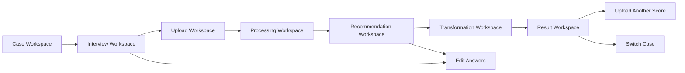

# Frontend Design Concept

Reference: [Design Index](./index.md)
Related architecture: [Architecture Overview](../architecture/overview.md)
Related frontend state mapping: [Frontend State Mapping](../architecture/frontend-state-mapping.md)
Related frontend structure: [Frontend Application Structure](../frontend/application-structure.md)

## Purpose

This document defines the recommended frontend design direction for the MVP.
It translates the approved architecture into a user experience that feels clear, trustworthy, and musically focused.

## Product Design Position

The product should feel like a guided musical workstation, not like a generic upload tool and not like an AI chat app.

The interface should communicate:

- musical precision
- guided decision-making
- confidence and traceability
- calm control during asynchronous processing

The design should avoid:

- playful consumer-app styling
- overly technical operator dashboards
- vague AI-assistant aesthetics

## Visual Direction

### Core Mood

The frontend should feel:

- editorial rather than dashboard-heavy
- focused rather than noisy
- trustworthy rather than magical
- modern but not trendy for its own sake

### Color Direction

Recommended palette behavior:

- warm off-white or muted paper-toned background
- deep charcoal or near-black text
- one restrained accent color for actions and highlights
- semantic colors for success, warning, error, and low-confidence states

Recommended emotional reading:

- background should evoke sheet paper or studio workspace, not sterile SaaS white
- accent should suggest control and guidance, not entertainment

### Typography Direction

Typography should support the music-oriented character of the product.

Recommended split:

- a refined serif or humanist display face for page titles and section headings
- a highly readable sans-serif for body text, controls, and status labels
- monospace only for technical identifiers or downloadable artifact metadata

The typography should create a feeling closer to notation, score annotation, and editorial review than to default web-app UI.

### Surface And Spacing Direction

- large, calm content areas
- clear vertical rhythm
- soft grouping through cards and panels
- sparse but intentional borders
- enough whitespace for decision-heavy screens such as recommendations

## Core Experience Principle

The frontend should present the product as a sequence of informed decisions.

The UI should make the user feel:

1. what information is already known
2. what still needs to be decided
3. what the AI recommends
4. what the system is doing right now
5. what can be safely acted on next

## Interaction Model

### Primary Navigation Model

The MVP should behave like a guided single-flow workspace, not a large multi-area application.

Recommended navigation structure:

- one primary work area
- lightweight progress framing across the top or side
- contextual secondary actions inside each stage

Recommended top-level flow:

- case selection
- interview
- upload
- recommendation review
- safe score preview
- transformation status
- result

### Screen Flow Diagram

Diagram purpose:
Show the recommended screen-level framing of the MVP as a guided workspace with a clear forward path and controlled return paths.

What to read from it:
The frontend should feel like one coherent workflow. Returning to earlier stages is allowed, but those returns should be deliberate and limited to meaningful actions such as editing answers, uploading another score, or switching cases.

Why it belongs here:
This file owns the product-facing design concept and is the correct place to define how the workflow should feel at screen level.

## Screen Concepts

### 1. Case Workspace

Purpose:
Help the user either continue an existing musical context or start a new one.

Design behavior:

- highlight the recommended default case
- show other available cases in a quieter secondary list
- make "create new case" obvious but not dominant over continuation

Desired feeling:
The user should feel oriented immediately, not dropped into an empty system.

### 2. Interview Workspace

Purpose:
Guide the user through constraint capture without making the experience feel like a raw form dump.

Design behavior:

- one primary question focus at a time
- visible progress through the interview
- concise contextual help
- clear difference between required input and optional clarification

Desired feeling:
The user should feel coached, not interrogated.

### 3. Upload Workspace

Purpose:
Transition from case preparation to score-specific work.

Design behavior:

- a single dominant upload action
- strong readiness confirmation that the case is valid for upload
- parsing and queue status shown as calm progress feedback, not as log output

Desired feeling:
The user should feel that the system is prepared before the file is submitted.

### 4. Recommendation Workspace

Purpose:
Present AI output as informed options, not as unquestionable truth.

Design behavior:

- one clearly emphasized primary recommendation
- secondary recommendations shown as alternatives, not noise
- warnings and confidence shown inline with the recommendation they affect
- rationale kept short and readable

Desired feeling:
The user should feel assisted by expertise while remaining in control of the final decision.

### 5. Transformation Workspace

Purpose:
Make asynchronous processing legible and trustworthy.

Design behavior:

- visible current status
- stable progress messaging across `queued`, `parsing`, `transforming`, and failure states
- retry action only when genuinely available

Desired feeling:
The user should feel that the system is working methodically, not unpredictably.

### 6. Result Workspace

Purpose:
Close the loop with clear access to the transformed output.

Design behavior:

- emphasize successful result availability
- use result preview as a trust-building verification surface when available
- keep the primary action on download
- place print as a secondary or contextual action
- make "upload another score in same case" easy to reach

Desired feeling:
The product should end with completion and continuity, not with a dead-end success message.

## Recommendation Card Concept

Recommendation cards are the most product-defining UI element in the MVP.

Each card should present:

- recommendation label
- target range
- optional key guidance
- short rationale
- confidence level
- warnings
- primary or secondary emphasis

Layout guidance:

- primary recommendation gets stronger contrast and visual priority
- secondary options remain clearly selectable but calmer
- warnings should not visually overpower the full card unless blocking

## Status And Trust Signaling

The design must clearly separate:

- `ready`
- `queued`
- `processing`
- `warning`
- `low confidence`
- `failed`
- `completed`

Recommended signaling approach:

- status chips or compact badges for quick state recognition
- short explanatory copy near the active action area
- stronger color treatment only for failure and blocking situations

## Testability Expectations

The design should remain easy to verify in implementation.

Required design-testability outcomes:

- `queued`, `processing`, `warning`, `low confidence`, `failed`, and `completed` states should be visually distinguishable without relying on one color alone
- primary and secondary recommendation cards should stay distinguishable in both content and emphasis
- retryable and non-retryable failure states should not look behaviorally identical
- layouts should preserve readable state communication on both desktop and mobile breakpoints

Backend collaboration note:
The backend should expose stable structured status semantics such as severity, retryability, confidence level, and concise safe summaries.
The design layer owns how those semantics are visually rendered, but it should not depend on raw backend failure text or hidden log details.

Confidence must never look identical to success.
Low-confidence recommendations should visually signal uncertainty without making the screen feel broken.

## Warning And Error Presentation

Warnings and errors should be calm, legible, and structured.

Recommended rule:

- blocking errors: prominent panel near the main action
- recoverable errors: clear retry affordance plus short explanation
- informational warnings: lower-emphasis note blocks or inline callouts

The design should avoid dumping technical detail into the main workflow.

Backend collaboration note:
Warnings and failures should arrive as typed and presentation-safe data.
Visual hierarchy, color emphasis, and screen placement remain design decisions rather than backend responsibilities.

## Layout System Recommendation

The MVP frontend should use a narrow set of repeated layout patterns:

- `workspace shell`
- `stage header`
- `primary action panel`
- `secondary context panel`
- `status strip`
- `recommendation card group`

This repetition will make the product feel coherent even while the internal feature states change.

Implementation note:
These patterns should map directly to reusable frontend component families rather than remain purely visual guidance.
At minimum, frontend implementation should provide reusable `workspace`, `status`, `recommendation`, and `action` component groups.

## Responsive Behavior

Desktop:

- two-column compositions for recommendation and result-heavy screens
- persistent stage framing is acceptable
- in preview-capable result states, use preview as the primary column and actions or status as the secondary column

Mobile:

- single-column flow
- stacked action areas
- place the `Original` / `Result` switch above the preview and keep download below the preview area
- progress framing compressed into a simpler step indicator

The interview and recommendation screens should remain fully usable on mobile, even if print-related interactions are naturally secondary there.

## Accessibility Direction

- color must not be the only carrier of status meaning
- confidence and warning states need text labels
- action hierarchy should remain clear for keyboard and screen-reader use
- upload, retry, and recommendation selection actions must be unambiguous

## Frontend Collaboration Expectation

The design direction assumes that frontend implementation will preserve a small set of repeated product-specific UI patterns instead of composing each screen independently.

The most important implementation-aligned design patterns are:

- one consistent workspace shell across the main flow
- one shared status signaling system across queued, processing, warning, low-confidence, failed, and completed states
- one dedicated recommendation-card family for primary and secondary options

## Design Ownership

- `Designer` owns the visual direction, screen composition logic, and recommendation presentation model
- `Frontend` owns implementation details within this design direction
- `Architect` owns the allowed state meanings and flow boundaries
