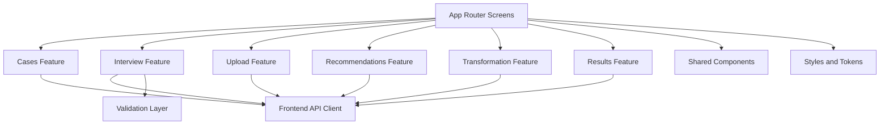

# Frontend Application Structure

Reference: [Frontend Index](./index.md)
Related architecture: [Module Design](../architecture/module-design.md)
Related interfaces: [Interfaces](../architecture/interfaces.md)
Related frontend state mapping: [Frontend State Mapping](../architecture/frontend-state-mapping.md)

## Purpose

This document defines the planned page, feature, and state structure of the MVP frontend.

## Planned Feature Areas

- `cases`: case listing, default-entry selection, create, switch, and reset interactions
- `interview`: question rendering, answer submission, validation, progress state
- `upload`: file selection, upload handling, parsing feedback
- `recommendations`: recommendation list, stale-state handling, warnings, selection
- `transformation`: job polling, progress state, retry handling
- `results`: download action, optional print handoff, warning summary
- `shared`: reusable UI primitives, layout, API client helpers, validation utilities

## Planned Directory Shape

```text
src/
  app/
  features/
    cases/
    interview/
    upload/
    recommendations/
    transformation/
    results/
  components/
  lib/
    api/
    validation/
    utils/
  styles/
```

## Frontend Structure Diagram



Diagram purpose:
Show the planned frontend feature decomposition and the shared layers that support page-level implementation.

What to read from it:
The UI is organized by product feature, while API access, validation, and reusable components stay centralized in shared support layers.

Why it belongs here:
This file owns the internal frontend structure and the implementation shape of the UI layer.

## State Handling Plan

- Local component state should handle transient view behavior such as modal visibility or local selection.
- `react-hook-form` should own interview-form state and validation lifecycle.
- `TanStack Query` should own backend-derived state such as cases, recommendations, transformations, and polling.
- Long-running upload and processing states should be read from dedicated status queries such as `GET /cases/{id}`, `GET /scores/{id}`, and `GET /transformations/{id}` instead of being inferred from mutation success alone.
- Recommendation freshness must be derived from case-constraint changes and surfaced as explicit UI state.
- Global state should be introduced only if cross-feature coordination becomes unmanageable with local state and query caches.

## Screen Responsibilities

- Case entry screen: show the default suggested case, other reusable cases, and case-creation entry
- Interview screen: render question objects and submit structured answers
- Upload screen: block upload until the selected case is ready and show parsing status
- Upload screen: poll score-status snapshots after upload acceptance until parsing and recommendation readiness become visible
- Recommendation screen: show primary and secondary recommendations, warnings, and stale state
- Transformation screen: show progress, retry path, and failure messaging
- Result screen: expose MusicXML download and optional print handoff

## Testing Priorities

- verify case entry and case switching behavior
- verify interview question rendering for multiple question types
- verify upload gating based on case readiness
- verify stale recommendation behavior after case edits
- verify transformation polling and result-state transitions
