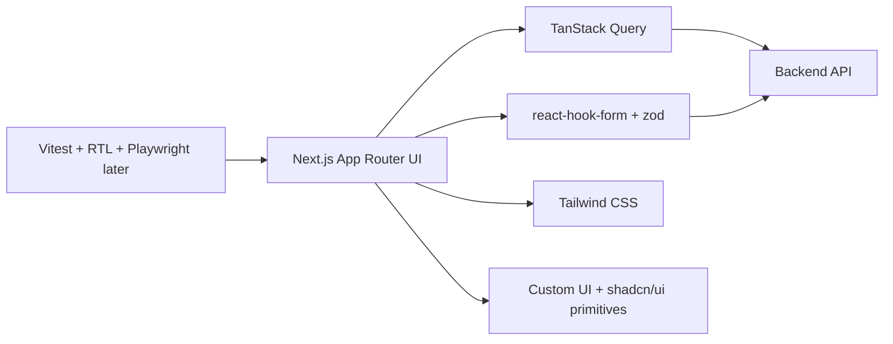

# Frontend Implementation Plan

Reference: [Frontend Index](./index.md)
Related architecture: [Architecture Overview](../architecture/overview.md)
Related frontend state mapping: [Frontend State Mapping](../architecture/frontend-state-mapping.md)

## Purpose

This document defines the planned frontend delivery stack for the MVP and explains how the frontend will turn the approved architecture into an implementation-ready web application.

## Recommended Stack

- framework: `Next.js` with `React` and `TypeScript`
- styling: `Tailwind CSS`
- component base: custom components with selective `shadcn/ui` primitives when they reduce low-value boilerplate
- forms and validation: `react-hook-form` with `zod`
- async server state: `TanStack Query`
- icons: `lucide-react`
- testing: `Vitest`, `React Testing Library`, and later `Playwright` for critical end-to-end flows

## Stack Decision Notes

- `Next.js` is the recommended baseline because the product is a structured web workflow with page transitions, uploads, async processing, and result retrieval.
- `TypeScript` is required because the frontend depends on typed API contracts and state transitions.
- `Tailwind CSS` is preferred for rapid MVP delivery and explicit design-token control without forcing a heavyweight component system.
- `react-hook-form` and `zod` fit the questionnaire flow and make validation rules explicit.
- `TanStack Query` should own API-fetching and polling concerns so UI state does not become mixed with network state.
- Long-running upload, parsing, recommendation, and transformation progress should be driven by dedicated read endpoints and query polling rather than by trusting mutation responses as durable state.
- A global state library should not be introduced by default. Local component state and query state should be sufficient for the MVP.

## Frontend Delivery Diagram

Diagram purpose:
Show the planned frontend implementation stack and how the UI layer, form handling, server-state handling, styling, and testing fit together.

What to read from it:
The frontend uses a small number of focused tools. Forms and validation handle questionnaire input, query state handles backend interaction, and the component layer remains lightweight and under project control.

Why it belongs here:
This file owns the implementation stack and delivery plan for the frontend rather than the product architecture itself.

## Implementation Priorities

1. Set up the application shell with routing, TypeScript, and Tailwind CSS.
2. Build the case selection and case creation entry screen.
3. Build the AI-guided interview flow with structured question rendering and validation.
4. Build the score upload flow and parsing-status feedback.
5. Build recommendation review and recommendation selection UI.
6. Build transformation-status polling and result view.
7. Add download handling and optional print handoff behavior.
8. Add targeted automated tests for critical state transitions and user flows.

## Dependency Policy

- Prefer native browser and framework capabilities before adding packages.
- Add `shadcn/ui` only as a selective primitive source, not as a full design substitute.
- Avoid a large global store until real cross-feature state pressure exists.
- Treat end-to-end testing as phase two after the core flow is stable.

## Design-System Delivery Expectations

- shared layout primitives should be implemented early so the product keeps one consistent workspace feel across all stages
- status, warning, and confidence tokens should be implemented as reusable design tokens rather than per-screen ad hoc styling
- typography and spacing decisions should reinforce the editorial, music-oriented product direction instead of default utility-first UI output

## Safety Delivery Expectations

- status rendering should consume typed backend metadata such as `severity`, `isRetryable`, `confidence`, and `safeSummary` instead of inventing UI behavior from raw errors
- upload UX should display only trusted file metadata needed for the workflow and should not rely on raw file-content rendering by default
- low-confidence states must be implemented as first-class UI states, not as cosmetically weaker success states

## Cloud Delivery Expectations

- frontend configuration should consume environment-scoped backend base URLs rather than hardcoded endpoints
- preview deployments should be shareable for design and product review without changing application behavior assumptions
- browser-exposed configuration must never include server-side storage or AI-provider secrets
