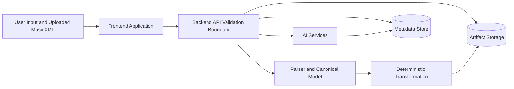

# MVP Safety Model

Reference: [Safety Index](./index.md)
Related architecture: [Interfaces](../architecture/interfaces.md)
Related observability: [Observability](../architecture/observability.md)
Related data model: [Data Model](../architecture/data-model.md)
Related backend structure: [Backend Application Structure](../backend/application-structure.md)
Related AI plan: [AI Implementation Plan](../ai/implementation-plan.md)

## Purpose

This document defines the MVP safety model for the AI-guided sheet music transposition system.
It focuses on realistic risks in the approved architecture and the minimum safeguards required before implementation should be considered safe enough for MVP use.

## Safety Scope For The MVP

The MVP safety model focuses on:

- untrusted file uploads
- unsafe or misleading AI-derived constraints
- recommendation outputs that may look more certain than they are
- unsafe blending of confirmed and inferred user constraints
- privacy exposure through stored user and score metadata
- frontend exposure to raw backend failures or unsafe status text

This document does not attempt to define full enterprise security posture.
It defines the minimum product and system safeguards needed for the current MVP architecture.

## Primary Safety Goals

- never mutate score output directly from unchecked AI output
- never treat inferred constraints as confirmed user reality without explicit backend-controlled confirmation
- never allow raw uploaded files to bypass validation and parsing boundaries
- never expose raw internal failures to the user interface as if they were presentation-ready messages
- minimize sensitive user-specific musical profile data while preserving required functionality

## Trust Boundary Diagram

Diagram purpose:
Show the main trust boundaries where untrusted input enters the system and where validated, typed, or deterministic processing must take over.

What to read from it:
User answers, uploaded MusicXML, and AI outputs are all untrusted or partially trusted until they cross explicit backend validation and typed persistence boundaries. Deterministic parsing, transformation, and storage must not rely on unchecked conversational output.

Why it belongs here:
This file owns the MVP safety view and is the correct place to show where trust must be earned rather than assumed.

## Safety-Critical Boundaries

### 1. File Upload Boundary

Risk:
Uploaded MusicXML is untrusted input.
It may be malformed, oversized, unexpectedly structured, or intentionally crafted to break parser assumptions.

Required MVP protections:

- allow only supported file types
- enforce file size limits
- reject malformed MusicXML early
- isolate parsing from raw upload handling
- never treat uploaded data as trusted display content without validation

### 2. AI Interview Boundary

Risk:
The AI may misunderstand the user, over-infer missing answers, or produce constraints that appear authoritative even when they are uncertain.

Required MVP protections:

- follow-up questioning on low-confidence interview interpretation
- schema-constrained interview outputs
- explicit separation between confirmed case constraints and `InferredConstraintSet`
- backend-controlled confirmation rules before confirmed case state is updated

### 3. AI Recommendation Boundary

Risk:
Recommendation output may be plausible but still unsafe, incomplete, or misleading for a specific player and instrument context.

Required MVP protections:

- recommendations must remain advisory
- user must explicitly select the recommendation before deterministic transformation begins
- low-confidence recommendations must remain visibly low confidence
- blocked confidence must stop recommendation output rather than fabricate a normal-looking option

### 4. Deterministic Execution Boundary

Risk:
If deterministic transformation accepts unchecked upstream data, the system may produce incorrect results while appearing trustworthy.

Required MVP protections:

- transformation uses validated score data and selected target range only
- transformation must not execute directly from raw AI prose
- warnings must be emitted when clean adaptation is not possible
- original artifacts must remain immutable and separately stored

### 5. Presentation Boundary

Risk:
Raw internal failures, parser messages, or provider-specific AI failures may be unsafe, confusing, or privacy-leaking when shown directly in the UI.

Required MVP protections:

- frontend consumes typed status and presentation-safe summaries
- backend normalizes severity, retryability, and safe summaries
- logs stay separate from user-facing status text

## Constraint Safety Rules

The MVP must preserve three distinct constraint categories:

- generic instrument knowledge
- confirmed user-specific case constraints
- AI-inferred but not yet confirmed constraints

Safety rule:
These categories must never collapse into one implicit truth source.

Why this matters:

- generic instrument knowledge is useful but not user-specific
- inferred constraints are useful but uncertain
- confirmed constraints are the only safe basis for deterministic user-specific execution

## Recommendation Safety Rules

- the UI must show confidence and warnings with each recommendation
- stale recommendations must not remain selectable after relevant case edits
- the system must not auto-start transformation after recommendation generation
- the system must not auto-promote a recommendation to a confirmed choice without user action

## Privacy And Data Minimization

The MVP stores user-specific musical ability data.
Even if this is not high-regulation data by default, it is still personal preference and capability information and should be treated carefully.

Required MVP protections:

- store only the constraint fields required for product behavior
- avoid storing unnecessary free-text user content when structured fields are sufficient
- separate metadata storage from artifact storage
- avoid leaking internal storage paths, raw prompts, or raw internal error text through read endpoints

Recommended practice:

- keep user-facing summaries concise and presentation-safe
- avoid making score content broadly searchable unless later explicitly required
- use least-privilege cloud credentials and private artifact storage by default

## Failure And Recovery Safety Rules

- failures must be typed by step
- retry should be offered only when recovery is actually safe
- generic unknown failure messaging should be avoided when a specific typed failure is available
- parse failure, recommendation failure, and transformation failure must remain distinguishable
- protected logs may contain deeper diagnostics, but normal cloud-hosted user flows must not expose them

## AI Safety Rules

- structured outputs only when backend persistence depends on the result
- no hidden promotion of inferred constraints into confirmed case state
- no direct deterministic score mutation from AI output
- no silent fallback to fabricated recommendation content when confidence is blocked
- no dependence on implicit model memory as the primary safety mechanism
- no normal user-facing flow should depend on raw prompt text, raw provider traces, or free-form model prose when a schema-constrained result is required

## Safe Frontend Expectations

The frontend should:

- clearly mark low-confidence recommendations
- distinguish warnings from blocking errors
- avoid presenting AI language as guaranteed musical truth
- expose retry only when the backend marks a path as retryable
- keep download and result access separate from internal diagnostic details
- avoid rendering raw uploaded score content as normal workflow UI unless a later dedicated safe preview design is explicitly added
- prefer typed presentation metadata such as severity and safe summaries over raw internal error text

## MVP Safety Checklist

- file type and size validation exists
- parser rejects malformed MusicXML
- interview follow-up occurs on low confidence
- inferred and confirmed constraints are stored separately
- recommendation confidence is visible and operational
- stale recommendations are blocked from execution
- deterministic transformation does not consume unchecked AI text
- original and transformed artifacts are stored separately
- frontend reads presentation-safe status metadata
- failures are typed and step-specific

## Safety Verification Expectations

The MVP should not rely on policy text alone for these safeguards.
The following safety checks should be backed by automated verification where practical:

- malformed and oversized upload rejection
- separation between confirmed and inferred constraints
- blocked-confidence recommendation handling
- stale recommendation blocking
- absence of raw diagnostics and raw provider text in normal user-facing payloads
- retry visibility only on retryable paths

## Ownership

- `Safety` owns the threat framing, minimum safeguards, and escalation of unsafe assumptions
- `Architect` owns the architectural boundaries that make these safeguards enforceable
- `Backend` owns validated execution, typed failures, and safe read models
- `AI` owns schema-constrained model behavior and visible uncertainty handling
- `Frontend` owns safe presentation of warnings, confidence, and retry behavior
