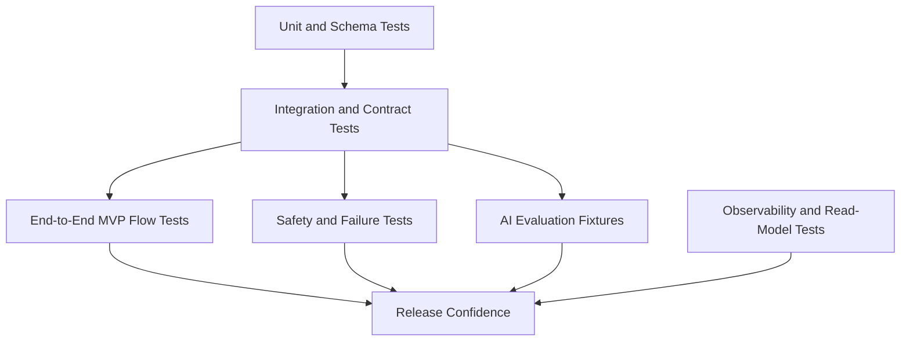

# MVP Test Strategy

Reference: [Test Index](./index.md)
Related features: [Architecture Features](../architecture/features.md)
Related observability: [Observability](../architecture/observability.md)
Related frontend plan: [Frontend Implementation Plan](../frontend/implementation-plan.md)
Related backend plan: [Backend Implementation Plan](../backend/implementation-plan.md)
Related AI plan: [AI Implementation Plan](../ai/implementation-plan.md)
Related safety model: [MVP Safety Model](../safety/mvp-safety-model.md)

## Purpose

This document defines how the MVP should be verified before implementation can be considered trustworthy enough for release.
It translates the approved architecture into concrete test layers, regression-critical flows, and release confidence criteria.

## Test Strategy Principles

- verify the smallest stable unit at the lowest useful layer
- keep critical user flows covered end to end even when lower-layer tests exist
- treat AI, safety, and observability behavior as first-class test scope rather than optional extras
- prefer typed assertions over snapshot-heavy tests where contracts and state transitions are the real behavior
- keep release confidence tied to the MVP feature flow, not to superficial line coverage

## MVP Test Coverage Diagram

Diagram purpose:
Show the minimum test layers that must work together before the MVP can be considered releaseable.

What to read from it:
The MVP is not validated by one test type alone. Unit and schema tests protect boundaries, integration tests protect module behavior, end-to-end tests protect the real workflow, and safety, AI, and observability checks determine whether the product is trustworthy in failure and uncertainty cases.

Why it belongs here:
This file owns the MVP verification strategy and is the correct place to show how the project turns architecture risks into test layers.

## Test Layers

### 1. Unit And Schema Tests

Purpose:
Protect pure logic, validation rules, and typed contract shapes before larger flows depend on them.

Primary targets:

- frontend state mappers and UI state guards
- backend validation and transformation helper logic
- API schema serialization and deserialization
- AI structured output parsers
- status, warning, and failure normalization logic

Expected tools:

- frontend: `Vitest`
- backend and AI: `pytest`

### 2. Integration And Contract Tests

Purpose:
Verify that module boundaries remain stable across frontend, backend, AI, persistence, and read-model layers.

Primary targets:

- interview request and response contracts
- case readiness and persistence behavior
- upload acceptance and parse-status transitions
- recommendation context assembly from confirmed constraints, inferred constraints, instrument knowledge, and canonical score summaries
- recommendation creation and selection persistence
- transformation job creation and export artifact references
- read endpoints such as `GET /cases/{id}`, `GET /scores/{id}`, and `GET /transformations/{id}`

What these tests must catch:

- contract drift
- incorrect state transitions
- invalid status exposure
- unsafe blending of confirmed and inferred constraints
- stale recommendation handling
- missing presentation metadata such as `severity`, `isRetryable`, `confidence`, and `safeSummary`

### 3. End-To-End MVP Flow Tests

Purpose:
Prove that the first usable product flow works from case setup through result download.

Minimum required flow:

1. create or select case
2. complete the interview until the case becomes ready
3. upload MusicXML
4. observe score processing through typed status snapshots
5. review recommendations
6. select a recommendation
7. observe transformation completion
8. download the output MusicXML

Critical variants:

- low-confidence interview triggers follow-up instead of silent confirmation
- low-confidence recommendation remains visibly low confidence
- stale recommendation becomes non-executable after case edits
- retry appears only on retryable failures

Expected tools:

- frontend-led browser flow tests later with `Playwright`
- backend-supported seeded test environments for stable flow setup
- preview-environment smoke checks before production promotion

### 4. AI Evaluation Fixtures

Purpose:
Verify AI behavior at the product boundary without pretending that generic model quality checks are enough.

Required evaluation groups:

- missing or ambiguous interview answers
- blocked-confidence recommendation cases
- over-inference attempts
- confirmation-boundary cases where inferred constraints must not become confirmed automatically
- recommendation outputs with warnings, secondary options, and typed failure cases

Pass criteria:

- outputs remain schema-constrained
- low-confidence and blocked-confidence behavior follows the documented policy
- inferred constraints remain separated from confirmed case constraints
- no raw provider text is required for normal product behavior

### 5. Safety And Failure Tests

Purpose:
Verify that unsafe inputs and unsafe outputs are rejected, normalized, or clearly contained.

Required areas:

- MusicXML type and size validation
- malformed upload rejection
- parser failure typing
- recommendation failure typing
- transformation failure typing
- preview readiness and preview failure typing when safe score preview is introduced
- no raw exception text in user-facing read models
- no raw prompt or provider output in user-facing recommendation payloads
- no raw storage paths in normal frontend contracts

### 6. Observability And Read-Model Tests

Purpose:
Verify that the frontend and operators can rely on documented runtime states instead of guessing.

Required assertions:

- every major processing stage emits a typed status
- `queued`, `parsing`, `recommendation_pending`, `recommendation_ready`, `transforming`, `completed`, and `failed` are exposed consistently
- warning and failure payloads include stable typed metadata
- presentation metadata remains normalized and safe for UI rendering
- recommendation traces remain linked to case and score context
- stale recommendation state is visible after relevant case changes
- preview-readiness and download-readiness remain distinct when score preview exists

### 7. Deployment And Environment Smoke Tests

Purpose:
Verify that preview and production-like environments preserve the MVP workflow and do not break API, worker, or read-model behavior after deployment.

Required assertions:

- frontend can reach the configured backend environment
- API health is available after deploy
- worker liveness is visible after deploy
- at least one score-status read path works in the deployed environment
- deploy-time configuration does not change typed runtime-state meaning between environments

## Regression-Critical MVP Features

The following architecture features are regression-critical and should always remain under direct automated coverage:

- `F2` Structured Interview Session
- `F3` Case Readiness And Persistence
- `F4` MusicXML Upload Acceptance
- `F5` Score Parsing
- `F6` Recommendation Context Assembly
- `F7` Recommendation Generation
- `F8` Recommendation Review And Selection
- `F8b` Safe Score Preview And Result Comparison
- `F9` Deterministic Transformation
- `F10` Result Export
- `F11` Processing Status Visibility
- `F14` Handle Stale Recommendation
- `F15` Handle Retryable Processing Failure

## Ownership Model

- `Test` owns the overall test strategy, regression focus, and release confidence criteria.
- `Frontend` owns frontend unit tests and browser-level critical-flow tests.
- `Backend` owns backend unit, integration, contract, and runtime-state tests.
- `AI` owns structured output checks and AI evaluation fixtures.
- `Safety` defines safety-critical assertions that must not be weakened.
- `Architect` validates that test coverage still matches the approved system boundaries.

## MVP Release Confidence Criteria

The MVP should not be treated as release-ready until all of the following are true:

- critical contracts are covered by automated tests
- the main case-to-download flow passes in an end-to-end environment
- typed read models expose the documented runtime states
- stale recommendations are blocked from deterministic execution
- retry is shown only for retryable failures
- low-confidence and blocked-confidence behavior matches the documented AI policy
- upload hardening and malformed-input rejection are covered
- user-facing status payloads remain presentation-safe
- preview or post-deploy smoke verification passes before release is treated as acceptable

## Out Of Scope For The MVP

The following may be added later but should not block the first MVP release:

- large-scale browser matrix testing
- performance benchmarking beyond basic smoke checks
- heavy fuzzing infrastructure
- long-term statistical AI quality dashboards
- full chaos-testing of worker and broker infrastructure
